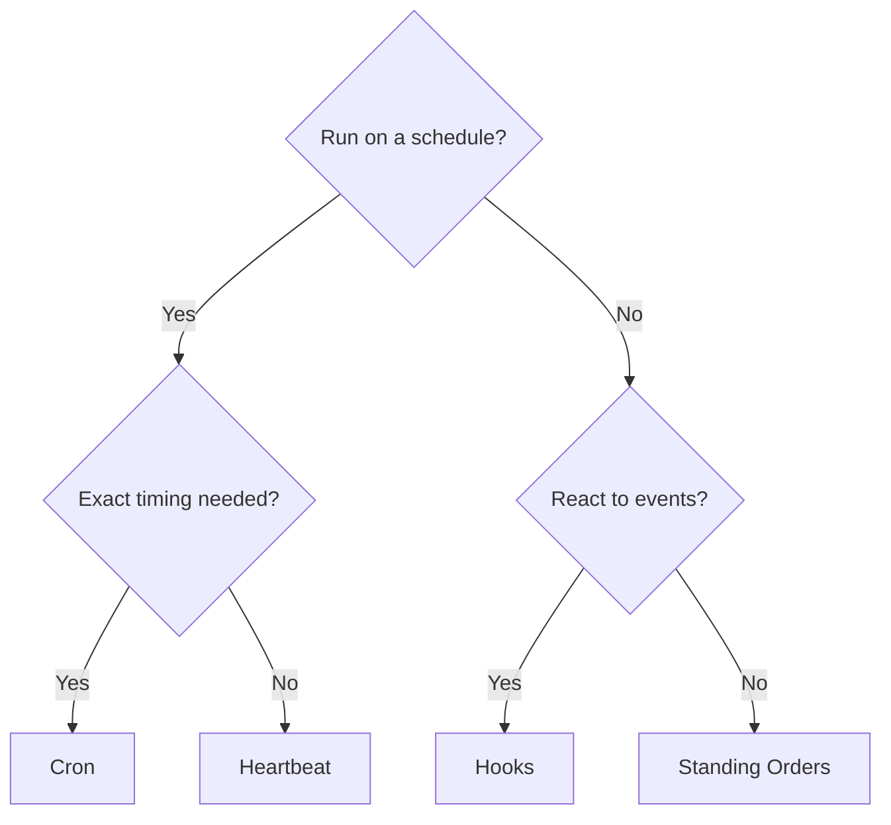

# Automatisation

OpenClaw fournit plusieurs mécanismes d'automatisation, chacun adapté à différents cas d'usage. Cette page vous aide à choisir le bon.

## Guide de décision rapide

## Mécanismes en un coup d'œil

| Mécanisme | Ce qu'il fait | S'exécute dans | Crée un enregistrement de tâche |
|---|---|---|---|
| [Heartbeat](/fr/gateway/heartbeat) | Tour de session principale périodique — regroupe plusieurs vérifications | Session principale | Non |
| [Cron](/fr/automation/cron-jobs) | Tâches planifiées avec timing précis | Session principale ou isolée | Oui (tous les types) |
| [Tâches en arrière-plan](/fr/automation/tasks) | Suit le travail détaché (cron, ACP, sous-agents, CLI) | N/A (ledger) | N/A |
| [Hooks](/fr/automation/hooks) | Scripts déclenchés par des événements du cycle de vie de l'agent | Hook runner | Non |
| [Standing Orders](/fr/automation/standing-orders) | Instructions persistantes injectées dans le system prompt | Session principale | Non |
| [Webhooks](/fr/automation/webhook) | Recevoir des événements HTTP entrants et les router vers l'agent | Gateway HTTP | Non |

### Automatisation spécialisée

| Mécanisme | Ce qu'il fait |
|---|---|
| [Gmail PubSub](/fr/automation/gmail-pubsub) | Notifications Gmail en temps réel via Google PubSub |
| [Polling](/fr/automation/poll) | Vérifications périodiques des sources de données (RSS, APIs, etc.) |
| [Surveillance d'authentification](/fr/automation/auth-monitoring) | Alertes de santé des identifiants et d'expiration |

## Comment ils fonctionnent ensemble

Les configurations les plus efficaces combinent plusieurs mécanismes :

1. **Heartbeat** gère la surveillance de routine (boîte de réception, calendrier, notifications) en un tour regroupé toutes les 30 minutes.
2. **Cron** gère les horaires précis (rapports quotidiens, révisions hebdomadaires) et les rappels ponctuels.
3. **Hooks** réagissent à des événements spécifiques (appels d'outils, réinitialisations de session, compaction) avec des scripts personnalisés.
4. **Standing Orders** donnent à l'agent un contexte persistant (« toujours vérifier le tableau de projet avant de répondre »).
5. **Tâches en arrière-plan** suivent automatiquement tout le travail détaché pour que vous puissiez l'inspecter et l'auditer.

Voir [Cron vs Heartbeat](/fr/automation/cron-vs-heartbeat) pour une comparaison détaillée des deux mécanismes de planification.

## Connexes

- [Cron vs Heartbeat](/fr/automation/cron-vs-heartbeat) — guide de comparaison détaillé
- [Dépannage](/fr/automation/troubleshooting) — débogage des problèmes d'automatisation
- [Référence de configuration](/fr/gateway/configuration-reference) — toutes les clés de configuration
