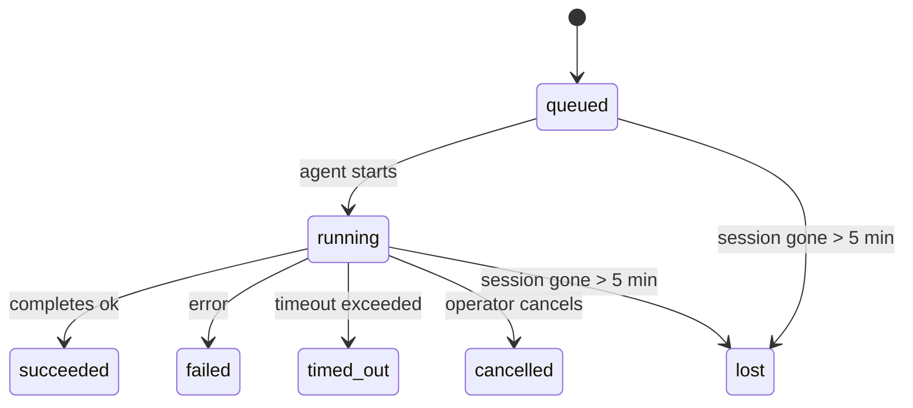

# Tâches de fond

> **Cron vs Heartbeat vs Tasks?** Voir [Cron vs Heartbeat](/fr/automation/cron-vs-heartbeat) pour choisir le bon mécanisme de planification. Cette page couvre le **suivi** du travail de fond, pas sa planification.

Les tâches de fond suivent le travail qui s'exécute **en dehors de votre session de conversation principale** :
exécutions ACP, spawns de sous-agents, exécutions de tâches cron isolées et opérations initiées par CLI.

Les tâches ne **remplacent pas** les sessions, les tâches cron ou les heartbeats — elles sont le **registre d'activité** qui enregistre quel travail détaché s'est produit, quand et s'il a réussi.

<Note>
Toutes les exécutions d'agent ne créent pas une tâche. Les tours de heartbeat et le chat interactif normal ne le font pas. Toutes les exécutions cron, spawns ACP, spawns de sous-agents et commandes d'agent CLI le font.
</Note>

## TL;DR

- Les tâches sont des **enregistrements**, pas des planificateurs — cron et heartbeat décident _quand_ le travail s'exécute, les tâches suivent _ce qui s'est passé_.
- ACP, les sous-agents, toutes les tâches cron et les opérations CLI créent des tâches. Les tours de heartbeat ne le font pas.
- Chaque tâche passe par `queued → running → terminal` (succeeded, failed, timed_out, cancelled, ou lost).
- Les notifications de fin sont livrées directement à un canal ou mises en file d'attente pour le prochain heartbeat.
- `openclaw tasks list` affiche toutes les tâches ; `openclaw tasks audit` met en évidence les problèmes.
- Les enregistrements terminaux sont conservés pendant 7 jours, puis automatiquement supprimés.

## Démarrage rapide

```bash
# Lister toutes les tâches (les plus récentes en premier)
openclaw tasks list

# Filtrer par runtime ou statut
openclaw tasks list --runtime acp
openclaw tasks list --status running

# Afficher les détails d'une tâche spécifique (par ID, ID d'exécution ou clé de session)
openclaw tasks show <lookup>

# Annuler une tâche en cours d'exécution (tue la session enfant)
openclaw tasks cancel <lookup>

# Modifier la politique de notification pour une tâche
openclaw tasks notify <lookup> state_changes

# Exécuter un audit de santé
openclaw tasks audit
```

## Ce qui crée une tâche

| Source                 | Type de runtime | Quand un enregistrement de tâche est créé                          | Politique de notification par défaut |
| ---------------------- | --------------- | ------------------------------------------------------------------ | ------------------------------------ |
| Exécutions ACP de fond | `acp`           | Spawning d'une session ACP enfant                                  | `done_only`                          |
| Orchestration de sous-agents | `subagent`   | Spawning d'un sous-agent via `sessions_spawn`                      | `done_only`                          |
| Tâches cron (tous types) | `cron`         | Chaque exécution cron (session principale et isolée)               | `silent`                             |
| Opérations CLI         | `cli`           | Commandes `openclaw agent` qui s'exécutent via la passerelle       | `done_only`                          |

Les tâches cron de session principale utilisent la politique de notification `silent` par défaut — elles créent des enregistrements pour le suivi mais ne génèrent pas de notifications. Les tâches cron isolées utilisent également `silent` par défaut mais sont plus visibles car elles s'exécutent dans leur propre session.

**Ce qui ne crée pas de tâches :**

- Tours de heartbeat — session principale ; voir [Heartbeat](/fr/gateway/heartbeat)
- Tours de chat interactif normal
- Réponses directes `/command`

## Cycle de vie des tâches



| Statut      | Ce que cela signifie                                                    |
| ----------- | ----------------------------------------------------------------------- |
| `queued`    | Créée, en attente du démarrage de l'agent                               |
| `running`   | Le tour de l'agent s'exécute activement                                 |
| `succeeded` | Complétée avec succès                                                   |
| `failed`    | Complétée avec une erreur                                               |
| `timed_out` | Dépassement du délai d'attente configuré                                |
| `cancelled` | Arrêtée par l'opérateur via `openclaw tasks cancel`                    |
| `lost`      | La session enfant de sauvegarde a disparu (détectée après 5 minutes)   |

Les transitions se produisent automatiquement — quand l'exécution d'agent associée se termine, le statut de la tâche se met à jour en conséquence.

## Livraison et notifications

Quand une tâche atteint un état terminal, OpenClaw vous notifie. Il y a deux chemins de livraison :

**Livraison directe** — si la tâche a une cible de canal (l'`requesterOrigin`), le message de fin va directement à ce canal (Telegram, Discord, Slack, etc.).

**Livraison en file d'attente de session** — si la livraison directe échoue ou qu'aucune origine n'est définie, la mise à jour est mise en file d'attente en tant qu'événement système dans la session du demandeur et s'affiche au prochain tick de heartbeat.

<Tip>
L'achèvement de la tâche déclenche un heartbeat immédiat pour que vous voyiez le résultat rapidement — vous n'avez pas à attendre le prochain tick de heartbeat planifié.
</Tip>

### Politiques de notification

Contrôlez la quantité d'informations que vous recevez sur chaque tâche :

| Politique             | Ce qui est livré                                                    |
| --------------------- | ------------------------------------------------------------------- |
| `done_only` (défaut)  | Seulement l'état terminal (succeeded, failed, etc.) — **c'est le défaut** |
| `state_changes`       | Chaque transition d'état et mise à jour de progression              |
| `silent`              | Rien du tout                                                        |

Modifiez la politique pendant qu'une tâche s'exécute :

```bash
openclaw tasks notify <lookup> state_changes
```

## Référence CLI

### `tasks list`

```bash
openclaw tasks list [--runtime <acp|subagent|cron|cli>] [--status <status>] [--json]
```

Colonnes de sortie : ID de tâche, Type, Statut, Livraison, ID d'exécution, Session enfant, Résumé.

### `tasks show`

```bash
openclaw tasks show <lookup>
```

Le token de recherche accepte un ID de tâche, un ID d'exécution ou une clé de session. Affiche l'enregistrement complet incluant les délais, l'état de livraison, l'erreur et le résumé terminal.

### `tasks cancel`

```bash
openclaw tasks cancel <lookup>
```

Pour les tâches ACP et sous-agent, cela tue la session enfant. Le statut passe à `cancelled` et une notification de livraison est envoyée.

### `tasks notify`

```bash
openclaw tasks notify <lookup> <done_only|state_changes|silent>
```

### `tasks audit`

```bash
openclaw tasks audit [--json]
```

Met en évidence les problèmes opérationnels. Les résultats apparaissent également dans `openclaw status` quand des problèmes sont détectés.

| Résultat                  | Sévérité | Déclencheur                                           |
| ------------------------- | -------- | ----------------------------------------------------- |
| `stale_queued`            | warn     | En file d'attente depuis plus de 10 minutes           |
| `stale_running`           | error    | En cours d'exécution depuis plus de 30 minutes        |
| `lost`                    | error    | La session de sauvegarde a disparu                    |
| `delivery_failed`         | warn     | La livraison a échoué et la politique de notification n'est pas `silent` |
| `missing_cleanup`         | warn     | Tâche terminale sans timestamp de nettoyage           |
| `inconsistent_timestamps` | warn     | Violation de chronologie (par exemple terminée avant le démarrage) |

## Intégration de statut (pression des tâches)

`openclaw status` inclut un résumé des tâches en un coup d'œil :

```
Tasks: 3 queued · 2 running · 1 issues
```

Le résumé rapporte :

- **active** — nombre de `queued` + `running`
- **failures** — nombre de `failed` + `timed_out` + `lost`
- **byRuntime** — répartition par `acp`, `subagent`, `cron`, `cli`

## Stockage et maintenance

### Où vivent les tâches

Les enregistrements de tâches persistent dans SQLite à :

```
$OPENCLAW_STATE_DIR/tasks/runs.sqlite
```

Le registre se charge en mémoire au démarrage de la passerelle et synchronise les écritures vers SQLite pour la durabilité entre les redémarrages.

### Maintenance automatique

Un sweeper s'exécute toutes les **60 secondes** et gère trois choses :

1. **Réconciliation** — vérifie si les sessions de sauvegarde des tâches actives existent toujours. Si une session enfant a disparu depuis plus de 5 minutes, la tâche est marquée `lost`.
2. **Marquage de nettoyage** — définit un timestamp `cleanupAfter` sur les tâches terminales (endedAt + 7 jours).
3. **Élagage** — supprime les enregistrements passés leur date `cleanupAfter`.

**Rétention** : les enregistrements de tâches terminales sont conservés pendant **7 jours**, puis automatiquement supprimés. Aucune configuration nécessaire.

## Comment les tâches se rapportent à d'autres systèmes

### Tâches et cron

Une **définition** de tâche cron vit dans `~/.openclaw/cron/jobs.json`. **Chaque** exécution cron crée un enregistrement de tâche — session principale et isolée. Les tâches cron de session principale utilisent par défaut la politique de notification `silent` pour suivre sans générer de notifications.

Voir [Tâches cron](/fr/automation/cron-jobs).

### Tâches et heartbeat

Les exécutions de heartbeat sont des tours de session principale — elles ne créent pas d'enregistrements de tâche. Quand une tâche se termine, elle peut déclencher un heartbeat pour que vous voyiez le résultat rapidement.

Voir [Heartbeat](/fr/gateway/heartbeat).

### Tâches et sessions

Une tâche peut référencer une `childSessionKey` (où le travail s'exécute) et une `requesterSessionKey` (qui l'a démarrée). Les sessions sont le contexte de conversation ; les tâches sont le suivi d'activité au-dessus.

### Tâches et exécutions d'agent

L'`runId` d'une tâche est lié à l'exécution d'agent qui fait le travail. Les événements du cycle de vie de l'agent (démarrage, fin, erreur) mettent automatiquement à jour le statut de la tâche — vous n'avez pas besoin de gérer le cycle de vie manuellement.

## Connexes

- [Automation Overview](/fr/automation) — tous les mécanismes d'automatisation en un coup d'œil
- [Tâches cron](/fr/automation/cron-jobs) — planification du travail de fond
- [Cron vs Heartbeat](/fr/automation/cron-vs-heartbeat) — choisir le bon mécanisme
- [Heartbeat](/fr/gateway/heartbeat) — tours de session principale périodiques
- [CLI: Tasks](/fr/cli/index#tasks) — référence de commande CLI
