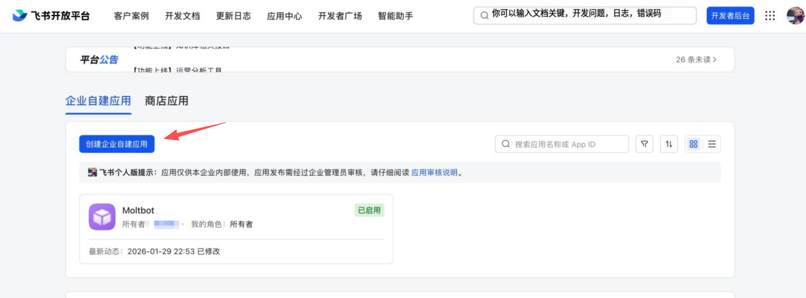
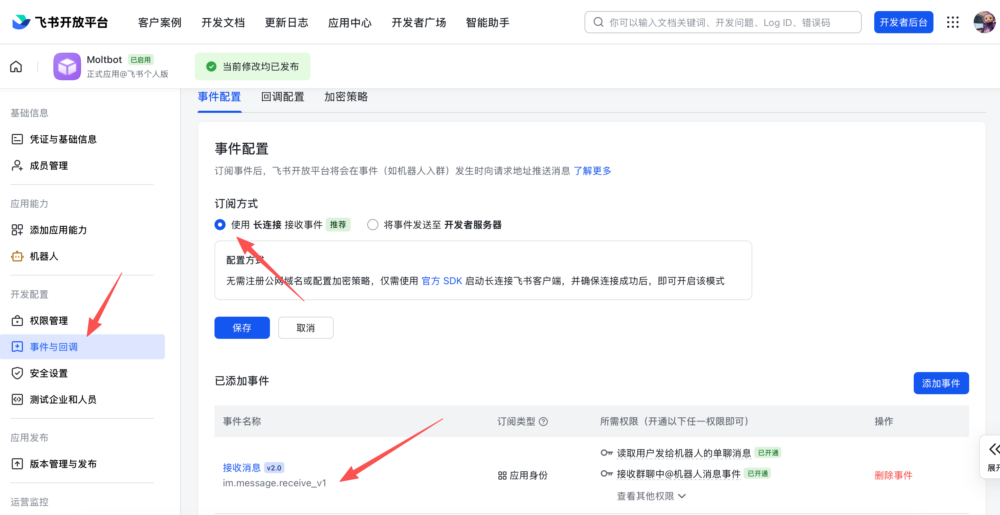

# Bot Feishu

Feishu (Lark) est une plateforme de chat d'équipe utilisée par les entreprises pour la messagerie et la collaboration. Ce plugin connecte OpenClaw à un bot Feishu/Lark en utilisant l'abonnement aux événements WebSocket de la plateforme afin que les messages puissent être reçus sans exposer une URL de webhook publique.

---

## Plugin fourni

Feishu est fourni en bundle avec les versions actuelles d'OpenClaw, donc aucune installation de plugin séparé n'est requise.

Si vous utilisez une version plus ancienne ou une installation personnalisée qui n'inclut pas Feishu en bundle, installez-le manuellement :

```bash
openclaw plugins install @openclaw/feishu
```

---

## Démarrage rapide

Il y a deux façons d'ajouter le canal Feishu :

### Méthode 1 : assistant d'intégration (recommandé)

Si vous venez d'installer OpenClaw, exécutez l'assistant :

```bash
openclaw onboard
```

L'assistant vous guide à travers :

1. La création d'une application Feishu et la collecte des identifiants
2. La configuration des identifiants de l'application dans OpenClaw
3. Le démarrage de la passerelle

✅ **Après la configuration**, vérifiez l'état de la passerelle :

- `openclaw gateway status`
- `openclaw logs --follow`

### Méthode 2 : configuration CLI

Si vous avez déjà terminé l'installation initiale, ajoutez le canal via CLI :

```bash
openclaw channels add
```

Choisissez **Feishu**, puis entrez l'ID de l'application et le secret de l'application.

✅ **Après la configuration**, gérez la passerelle :

- `openclaw gateway status`
- `openclaw gateway restart`
- `openclaw logs --follow`

---

## Étape 1 : Créer une application Feishu

### 1. Ouvrir la plateforme ouverte Feishu

Visitez [Plateforme ouverte Feishu](https://open.feishu.cn/app) et connectez-vous.

Les locataires Lark (mondiaux) doivent utiliser [https://open.larksuite.com/app](https://open.larksuite.com/app) et définir `domain: "lark"` dans la configuration Feishu.

### 2. Créer une application

1. Cliquez sur **Créer une application d'entreprise**
2. Remplissez le nom de l'application + description
3. Choisissez une icône d'application



### 3. Copier les identifiants

À partir de **Identifiants et informations de base**, copiez :

- **ID de l'application** (format : `cli_xxx`)
- **Secret de l'application**

❗ **Important :** gardez le secret de l'application privé.


### 4. Configurer les permissions

Sur **Permissions**, cliquez sur **Importer en masse** et collez :

```json
{
  "scopes": {
    "tenant": [
      "aily:file:read",
      "aily:file:write",
      "application:application.app_message_stats.overview:readonly",
      "application:application:self_manage",
      "application:bot.menu:write",
      "cardkit:card:read",
      "cardkit:card:write",
      "contact:user.employee_id:readonly",
      "corehr:file:download",
      "event:ip_list",
      "im:chat.access_event.bot_p2p_chat:read",
      "im:chat.members:bot_access",
      "im:message",
      "im:message.group_at_msg:readonly",
      "im:message.p2p_msg:readonly",
      "im:message:readonly",
      "im:message:send_as_bot",
      "im:resource"
    ],
    "user": ["aily:file:read", "aily:file:write", "im:chat.access_event.bot_p2p_chat:read"]
  }
}
```


### 5. Activer la capacité de bot

Dans **Capacité de l'application** > **Bot** :

1. Activez la capacité de bot
2. Définissez le nom du bot


### 6. Configurer l'abonnement aux événements

⚠️ **Important :** avant de configurer l'abonnement aux événements, assurez-vous que :

1. Vous avez déjà exécuté `openclaw channels add` pour Feishu
2. La passerelle est en cours d'exécution (`openclaw gateway status`)

Dans **Abonnement aux événements** :

1. Choisissez **Utiliser la connexion longue pour recevoir les événements** (WebSocket)
2. Ajoutez l'événement : `im.message.receive_v1`

⚠️ Si la passerelle n'est pas en cours d'exécution, la configuration de la connexion longue peut échouer à être enregistrée.



### 7. Publier l'application

1. Créez une version dans **Gestion des versions et publication**
2. Soumettez pour examen et publiez
3. Attendez l'approbation de l'administrateur (les applications d'entreprise s'approuvent généralement automatiquement)

---

## Étape 2 : Configurer OpenClaw

### Configurer avec l'assistant (recommandé)

```bash
openclaw channels add
```

Choisissez **Feishu** et collez votre ID d'application + secret de l'application.

### Configurer via le fichier de configuration

Modifiez `~/.openclaw/openclaw.json` :

```json5
{
  channels: {
    feishu: {
      enabled: true,
      dmPolicy: "pairing",
      accounts: {
        main: {
          appId: "cli_xxx",
          appSecret: "xxx",
          botName: "My AI assistant",
        },
      },
    },
  },
}
```

Si vous utilisez `connectionMode: "webhook"`, définissez à la fois `verificationToken` et `encryptKey`. Le serveur webhook Feishu se lie à `127.0.0.1` par défaut ; définissez `webhookHost` uniquement si vous avez intentionnellement besoin d'une adresse de liaison différente.

#### Jeton de vérification et clé de chiffrement (mode webhook)

Lors de l'utilisation du mode webhook, définissez à la fois `channels.feishu.verificationToken` et `channels.feishu.encryptKey` dans votre configuration. Pour obtenir les valeurs :

1. Dans la plateforme ouverte Feishu, ouvrez votre application
2. Allez à **Développement** → **Événements et rappels** (开发配置 → 事件与回调)
3. Ouvrez l'onglet **Chiffrement** (加密策略)
4. Copiez **Jeton de vérification** et **Clé de chiffrement**

La capture d'écran ci-dessous montre où trouver le **Jeton de vérification**. La **Clé de chiffrement** est listée dans la même section **Chiffrement**.


### Configurer via les variables d'environnement

```bash
export FEISHU_APP_ID="cli_xxx"
export FEISHU_APP_SECRET="xxx"
```

### Domaine Lark (mondial)

Si votre locataire est sur Lark (international), définissez le domaine sur `lark` (ou une chaîne de domaine complet). Vous pouvez le définir à `channels.feishu.domain` ou par compte (`channels.feishu.accounts.<id>.domain`).

```json5
{
  channels: {
    feishu: {
      domain: "lark",
      accounts: {
        main: {
          appId: "cli_xxx",
          appSecret: "xxx",
        },
      },
    },
  },
}
```

### Drapeaux d'optimisation des quotas

Vous pouvez réduire l'utilisation de l'API Feishu avec deux drapeaux optionnels :

- `typingIndicator` (par défaut `true`) : quand `false`, ignorez les appels de réaction de saisie.
- `resolveSenderNames` (par défaut `true`) : quand `false`, ignorez les appels de recherche de profil d'expéditeur.

Définissez-les au niveau supérieur ou par compte :

```json5
{
  channels: {
    feishu: {
      typingIndicator: false,
      resolveSenderNames: false,
      accounts: {
        main: {
          appId: "cli_xxx",
          appSecret: "xxx",
          typingIndicator: true,
          resolveSenderNames: false,
        },
      },
    },
  },
}
```

---

## Étape 3 : Démarrer + tester

### 1. Démarrer la passerelle

```bash
openclaw gateway
```

### 2. Envoyer un message de test

Dans Feishu, trouvez votre bot et envoyez un message.

### 3. Approuver l'appairage

Par défaut, le bot répond avec un code d'appairage. Approuvez-le :

```bash
openclaw pairing approve feishu <CODE>
```

Après approbation, vous pouvez discuter normalement.

---

## Aperçu

- **Canal de bot Feishu** : bot Feishu géré par la passerelle
- **Routage déterministe** : les réponses reviennent toujours à Feishu
- **Isolation des sessions** : les DM partagent une session principale ; les groupes sont isolés
- **Connexion WebSocket** : connexion longue via le SDK Feishu, aucune URL publique requise

---

## Contrôle d'accès

### Messages directs

- **Par défaut** : `dmPolicy: "pairing"` (les utilisateurs inconnus reçoivent un code d'appairage)
- **Approuver l'appairage** :

  ```bash
  openclaw pairing list feishu
  openclaw pairing approve feishu <CODE>
  ```

- **Mode liste blanche** : définissez `channels.feishu.allowFrom` avec les ID ouverts autorisés

### Chats de groupe

**1. Politique de groupe** (`channels.feishu.groupPolicy`) :

- `"open"` = autoriser tout le monde dans les groupes (par défaut)
- `"allowlist"` = autoriser uniquement `groupAllowFrom`
- `"disabled"` = désactiver les messages de groupe

**2. Exigence de mention** (`channels.feishu.groups.<chat_id>.requireMention`) :

- `true` = exiger @mention (par défaut)
- `false` = répondre sans mentions

---

## Exemples de configuration de groupe

### Autoriser tous les groupes, exiger @mention (par défaut)

```json5
{
  channels: {
    feishu: {
      groupPolicy: "open",
      // requireMention par défaut : true
    },
  },
}
```

### Autoriser tous les groupes, aucune @mention requise

```json5
{
  channels: {
    feishu: {
      groups: {
        oc_xxx: { requireMention: false },
      },
    },
  },
}
```

### Autoriser uniquement des groupes spécifiques

```json5
{
  channels: {
    feishu: {
      groupPolicy: "allowlist",
      // Les ID de groupe Feishu (chat_id) ressemblent à : oc_xxx
      groupAllowFrom: ["oc_xxx", "oc_yyy"],
    },
  },
}
```

### Restreindre les expéditeurs qui peuvent envoyer des messages dans un groupe (liste blanche d'expéditeurs)

En plus d'autoriser le groupe lui-même, **tous les messages** dans ce groupe sont contrôlés par l'open_id de l'expéditeur : seuls les utilisateurs listés dans `groups.<chat_id>.allowFrom` ont leurs messages traités ; les messages d'autres membres sont ignorés (c'est un contrôle complet au niveau de l'expéditeur, pas seulement pour les commandes de contrôle comme /reset ou /new).

```json5
{
  channels: {
    feishu: {
      groupPolicy: "allowlist",
      groupAllowFrom: ["oc_xxx"],
      groups: {
        oc_xxx: {
          // Les ID d'utilisateur Feishu (open_id) ressemblent à : ou_xxx
          allowFrom: ["ou_user1", "ou_user2"],
        },
      },
    },
  },
}
```

---

## Obtenir les ID de groupe/utilisateur

### ID de groupe (chat_id)

Les ID de groupe ressemblent à `oc_xxx`.

**Méthode 1 (recommandée)**

1. Démarrez la passerelle et @mentionnez le bot dans le groupe
2. Exécutez `openclaw logs --follow` et recherchez `chat_id`

**Méthode 2**

Utilisez le débogueur API Feishu pour lister les chats de groupe.

### ID d'utilisateur (open_id)

Les ID d'utilisateur ressemblent à `ou_xxx`.

**Méthode 1 (recommandée)**

1. Démarrez la passerelle et envoyez un DM au bot
2. Exécutez `openclaw logs --follow` et recherchez `open_id`

**Méthode 2**

Vérifiez les demandes d'appairage pour les ID ouverts d'utilisateur :

```bash
openclaw pairing list feishu
```

---

## Commandes courantes

| Commande  | Description           |
| --------- | --------------------- |
| `/status` | Afficher l'état du bot |
| `/reset`  | Réinitialiser la session |
| `/model`  | Afficher/changer le modèle |

> Remarque : Feishu ne supporte pas encore les menus de commande natifs, donc les commandes doivent être envoyées en tant que texte.

## Commandes de gestion de la passerelle

| Commande                   | Description                   |
| -------------------------- | ----------------------------- |
