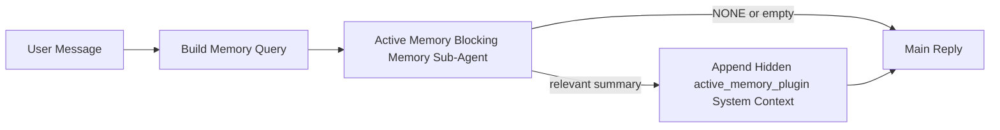

# Mémoire Active

La mémoire active est un sous-agent de mémoire bloquant optionnel appartenant au plugin qui s'exécute
avant la réponse principale pour les sessions conversationnelles éligibles.

Elle existe parce que la plupart des systèmes de mémoire sont capables mais réactifs. Ils s'appuient sur
l'agent principal pour décider quand rechercher la mémoire, ou sur l'utilisateur pour dire des choses
comme « mémorise ceci » ou « recherche la mémoire ». À ce moment-là, le moment où la mémoire aurait
rendu la réponse naturelle a déjà disparu.

La mémoire active donne au système une chance limitée de faire remonter la mémoire pertinente
avant que la réponse principale soit générée.

## Collez ceci dans votre agent

Collez ceci dans votre agent si vous voulez activer la mémoire active avec une
configuration sûre et autonome :

```json5
{
  plugins: {
    entries: {
      "active-memory": {
        enabled: true,
        config: {
          enabled: true,
          agents: ["main"],
          allowedChatTypes: ["direct"],
          modelFallbackPolicy: "default-remote",
          queryMode: "recent",
          promptStyle: "balanced",
          timeoutMs: 15000,
          maxSummaryChars: 220,
          persistTranscripts: false,
          logging: true,
        },
      },
    },
  },
}
```

Cela active le plugin pour l'agent `main`, le limite aux sessions de style message direct
par défaut, lui permet d'hériter du modèle de session actuel en premier, et
permet toujours le repli distant intégré si aucun modèle explicite ou hérité n'est
disponible.

Après cela, redémarrez la passerelle :

```bash
node scripts/run-node.mjs gateway --profile dev
```

Pour l'inspecter en direct dans une conversation :

```text
/verbose on
```

## Activez la mémoire active

La configuration la plus sûre est :

1. activer le plugin
2. cibler un agent conversationnel
3. garder la journalisation activée uniquement pendant l'ajustement

Commencez par ceci dans `openclaw.json` :

```json5
{
  plugins: {
    entries: {
      "active-memory": {
        enabled: true,
        config: {
          agents: ["main"],
          allowedChatTypes: ["direct"],
          modelFallbackPolicy: "default-remote",
          queryMode: "recent",
          promptStyle: "balanced",
          timeoutMs: 15000,
          maxSummaryChars: 220,
          persistTranscripts: false,
          logging: true,
        },
      },
    },
  },
}
```

Puis redémarrez la passerelle :

```bash
node scripts/run-node.mjs gateway --profile dev
```

Voici ce que cela signifie :

- `plugins.entries.active-memory.enabled: true` active le plugin
- `config.agents: ["main"]` opte uniquement l'agent `main` dans la mémoire active
- `config.allowedChatTypes: ["direct"]` garde la mémoire active activée pour les sessions de style message direct uniquement par défaut
- si `config.model` n'est pas défini, la mémoire active hérite du modèle de session actuel en premier
- `config.modelFallbackPolicy: "default-remote"` garde le repli distant intégré comme défaut lorsqu'aucun modèle explicite ou hérité n'est disponible
- `config.promptStyle: "balanced"` utilise le style d'invite par défaut à usage général pour le mode `recent`
- la mémoire active s'exécute toujours uniquement sur les sessions de chat persistant interactif éligibles

## Comment la voir

La mémoire active injecte un contexte système caché pour le modèle. Elle n'expose pas
les balises brutes `<active_memory_plugin>...</active_memory_plugin>` au client.

## Basculement de session

Utilisez la commande du plugin lorsque vous voulez mettre en pause ou reprendre la mémoire active pour la
session de chat actuelle sans éditer la configuration :

```text
/active-memory status
/active-memory off
/active-memory on
```

Ceci est limité à la session. Cela ne change pas
`plugins.entries.active-memory.enabled`, le ciblage des agents, ou d'autres
configurations globales.

Si vous voulez que la commande écrive la configuration et mette en pause ou reprenne la mémoire active pour
toutes les sessions, utilisez la forme globale explicite :

```text
/active-memory status --global
/active-memory off --global
/active-memory on --global
```

La forme globale écrit `plugins.entries.active-memory.config.enabled`. Elle laisse
`plugins.entries.active-memory.enabled` activé pour que la commande reste disponible
pour réactiver la mémoire active plus tard.

Si vous voulez voir ce que la mémoire active fait dans une session en direct, activez le mode verbeux
pour cette session :

```text
/verbose on
```

Avec le mode verbeux activé, OpenClaw peut afficher :

- une ligne d'état de mémoire active comme `Active Memory: ok 842ms recent 34 chars`
- un résumé de débogage lisible comme `Active Memory Debug: Lemon pepper wings with blue cheese.`

Ces lignes sont dérivées du même passage de mémoire active qui alimente le contexte système caché, mais
elles sont formatées pour les humains au lieu d'exposer le balisage d'invite brut.

Par défaut, la transcription du sous-agent de mémoire bloquant est temporaire et supprimée
après la fin de l'exécution.

Flux d'exemple :

```text
/verbose on
what wings should i order?
```

Forme de réponse visible attendue :

```text
...normal assistant reply...

🧩 Active Memory: ok 842ms recent 34 chars
🔎 Active Memory Debug: Lemon pepper wings with blue cheese.
```

## Quand elle s'exécute

La mémoire active utilise deux portes :

1. **Opt-in de configuration**
   Le plugin doit être activé, et l'ID d'agent actuel doit apparaître dans
   `plugins.entries.active-memory.config.agents`.
2. **Éligibilité d'exécution stricte**
   Même lorsqu'elle est activée et ciblée, la mémoire active s'exécute uniquement pour les sessions
   de chat persistant interactif éligibles.

La règle réelle est :

```text
plugin enabled
+
agent id targeted
+
allowed chat type
+
eligible interactive persistent chat session
=
active memory runs
```

Si l'une de ces conditions échoue, la mémoire active ne s'exécute pas.

## Types de session

`config.allowedChatTypes` contrôle quels types de conversations peuvent exécuter la mémoire active du tout.

La valeur par défaut est :

```json5
allowedChatTypes: ["direct"]
```

Cela signifie que la mémoire active s'exécute par défaut dans les sessions de style message direct, mais
pas dans les sessions de groupe ou de canal à moins que vous ne les optiez explicitement.

Exemples :

```json5
allowedChatTypes: ["direct"]
```

```json5
allowedChatTypes: ["direct", "group"]
```

```json5
allowedChatTypes: ["direct", "group", "channel"]
```

## Où elle s'exécute

La mémoire active est une fonctionnalité d'enrichissement conversationnel, pas une
fonctionnalité d'inférence à l'échelle de la plateforme.

| Surface                                                             | Exécute la mémoire active ?                                     |
| ------------------------------------------------------------------- | ------------------------------------------------------- |
| Interface de contrôle / sessions persistantes de chat web                           | Oui, si le plugin est activé et l'agent est ciblé |
| Autres sessions de canal interactif sur le même chemin de chat persistant | Oui, si le plugin est activé et l'agent est ciblé |
| Exécutions ponctuelles sans interface                                              | Non                                                      |
| Exécutions de battement cardiaque/arrière-plan                                           | Non                                                      |
| Chemins `agent-command` internes génériques                              | Non                                                      |
| Exécution de sous-agent/assistant interne                                 | Non                                                      |

## Pourquoi l'utiliser

Utilisez la mémoire active lorsque :

- la session est persistante et orientée utilisateur
- l'agent a une mémoire à long terme significative à rechercher
- la continuité et la personnalisation importent plus que le déterminisme d'invite brut

Elle fonctionne particulièrement bien pour :

- les préférences stables
- les habitudes récurrentes
- le contexte utilisateur à long terme qui devrait remonter naturellement

C'est un mauvais choix pour :

- l'automatisation
- les travailleurs internes
- les tâches API ponctuelles
- les endroits où la personnalisation cachée serait surprenante

## Comment ça marche

La forme d'exécution est :



Le sous-agent de mémoire bloquant ne peut utiliser que :

- `memory_search`
- `memory_get`

Si la connexion est faible, il devrait retourner `NONE`.

## Modes de requête

`config.queryMode` contrôle combien de conversation le sous-agent de mémoire bloquant voit.

## Styles d'invite

`config.promptStyle` contrôle à quel point le sous-agent de mémoire bloquant est enthousiaste ou strict
lorsqu'il décide s'il faut retourner la mémoire.

Styles disponibles :

- `balanced` : défaut à usage général pour le mode `recent`
- `strict` : le moins enthousiaste ; meilleur lorsque vous voulez très peu de débordement du contexte proche
- `contextual` : le plus favorable à la continuité ; meilleur lorsque l'historique de conversation devrait compter davantage
- `recall-heavy` : plus disposé à faire remonter la mémoire sur des correspondances plus douces mais toujours plausibles
- `precision-heavy` : préfère agressivement `NONE` à moins que la correspondance soit évidente
- `preference-only` : optimisé pour les favoris, les habitudes, les routines, le goût et les faits personnels récurrents

Mappage par défaut lorsque `config.promptStyle` n'est pas défini :

```text
message -> strict
recent -> balanced
full -> contextual
```

Si vous définissez `config.promptStyle` explicitement, ce remplacement gagne.

Exemple :

```json5
promptStyle: "preference-only"
```

## Politique de repli de modèle

Si `config.model` n'est pas défini, la mémoire active essaie de résoudre un modèle dans cet ordre :

```text
explicit plugin model
-> current session model
-> agent primary model
-> optional built-in remote fallback
```

`config.modelFallbackPolicy` contrôle la dernière étape.

Défaut :

```json5
modelFallbackPolicy: "default-remote"
```

Autre option :

```json5
modelFallbackPolicy: "resolved-only"
```

Utilisez `resolved-only` si vous voulez que la mémoire active ignore le rappel au lieu de revenir
au défaut distant intégré lorsqu'aucun modèle explicite ou hérité n'est
disponible.

## Échappatoires avancées

Ces options ne font intentionnellement pas partie de la configuration recommandée.

`config.thinking` peut remplacer le niveau de réflexion du sous-agent de mémoire bloquante :

```json5
thinking: "medium"
```

Par défaut :

```json5
thinking: "off"
```

N'activez pas ceci par défaut. Active Memory s'exécute dans le chemin de réponse, donc le temps de réflexion supplémentaire augmente directement la latence visible pour l'utilisateur.

`config.promptAppend` ajoute des instructions d'opérateur supplémentaires après l'invite Active Memory par défaut et avant le contexte de conversation :

```json5
promptAppend: "Prefer stable long-term preferences over one-off events."
```

`config.promptOverride` remplace l'invite Active Memory par défaut. OpenClaw ajoute toujours le contexte de conversation après :

```json5
promptOverride: "You are a memory search agent. Return NONE or one compact user fact."
```

La personnalisation des invites n'est pas recommandée sauf si vous testez délibérément un contrat de rappel différent. L'invite par défaut est réglée pour retourner soit `NONE` soit un contexte de fait utilisateur compact pour le modèle principal.

### `message`

Seul le dernier message utilisateur est envoyé.

```text
Latest user message only
```

Utilisez ceci quand :

- vous voulez le comportement le plus rapide
- vous voulez le biais le plus fort vers le rappel de préférence stable
- les tours de suivi n'ont pas besoin de contexte conversationnel

Délai d'expiration recommandé :

- commencez autour de `3000` à `5000` ms

### `recent`

Le dernier message utilisateur plus une petite queue conversationnelle récente est envoyée.

```text
Recent conversation tail:
user: ...
assistant: ...
user: ...

Latest user message:
...
```

Utilisez ceci quand :

- vous voulez un meilleur équilibre entre vitesse et ancrage conversationnel
- les questions de suivi dépendent souvent des derniers tours

Délai d'expiration recommandé :

- commencez autour de `15000` ms

### `full`

La conversation complète est envoyée au sous-agent de mémoire bloquante.

```text
Full conversation context:
user: ...
assistant: ...
user: ...
...
```

Utilisez ceci quand :

- la qualité de rappel la plus forte importe plus que la latence
- la conversation contient une configuration importante loin dans le fil

Délai d'expiration recommandé :

- augmentez-le substantiellement par rapport à `message` ou `recent`
- commencez autour de `15000` ms ou plus selon la taille du fil

En général, le délai d'expiration devrait augmenter avec la taille du contexte :

```text
message < recent < full
```

## Persistance des transcriptions

Les exécutions du sous-agent de mémoire bloquante Active Memory créent une vraie transcription `session.jsonl` pendant l'appel du sous-agent de mémoire bloquante.

Par défaut, cette transcription est temporaire :

- elle est écrite dans un répertoire temporaire
- elle est utilisée uniquement pour l'exécution du sous-agent de mémoire bloquante
- elle est supprimée immédiatement après la fin de l'exécution

Si vous voulez conserver ces transcriptions du sous-agent de mémoire bloquante sur le disque pour le débogage ou l'inspection, activez la persistance explicitement :

```json5
{
  plugins: {
    entries: {
      "active-memory": {
        enabled: true,
        config: {
          agents: ["main"],
          persistTranscripts: true,
          transcriptDir: "active-memory",
        },
      },
    },
  },
}
```

Lorsqu'elle est activée, la mémoire active stocke les transcriptions dans un répertoire séparé sous le dossier des sessions de l'agent cible, et non dans le chemin de transcription de conversation utilisateur principal.

La disposition par défaut est conceptuellement :

```text
agents/<agent>/sessions/active-memory/<blocking-memory-sub-agent-session-id>.jsonl
```

Vous pouvez modifier le sous-répertoire relatif avec `config.transcriptDir`.

Utilisez ceci avec prudence :

- les transcriptions du sous-agent de mémoire bloquante peuvent s'accumuler rapidement sur les sessions occupées
- le mode de requête `full` peut dupliquer beaucoup de contexte de conversation
- ces transcriptions contiennent un contexte d'invite caché et des mémoires rappelées

## Configuration

Toute la configuration de la mémoire active se trouve sous :

```text
plugins.entries.active-memory
```

Les champs les plus importants sont :

| Clé                         | Type                                                                                                 | Signification                                                                                                |
| --------------------------- | ---------------------------------------------------------------------------------------------------- | ------------------------------------------------------------------------------------------------------ |
| `enabled`                   | `boolean`                                                                                            | Active le plugin lui-même                                                                              |
| `config.agents`             | `string[]`                                                                                           | IDs d'agent qui peuvent utiliser la mémoire active                                                                   |
| `config.model`              | `string`                                                                                             | Référence de modèle du sous-agent de mémoire bloquante optionnelle ; lorsque non défini, la mémoire active utilise le modèle de session actuel |
| `config.queryMode`          | `"message" \| "recent" \| "full"`                                                                    | Contrôle la quantité de conversation que le sous-agent de mémoire bloquante voit                                      |
| `config.promptStyle`        | `"balanced" \| "strict" \| "contextual" \| "recall-heavy" \| "precision-heavy" \| "preference-only"` | Contrôle le degré d'empressement ou de rigueur du sous-agent de mémoire bloquante lors de la décision de retourner la mémoire   |
| `config.thinking`           | `"off" \| "minimal" \| "low" \| "medium" \| "high" \| "xhigh" \| "adaptive"`                         | Remplacement avancé de la réflexion pour le sous-agent de mémoire bloquante ; par défaut `off` pour la vitesse                  |
| `config.promptOverride`     | `string`                                                                                             | Remplacement avancé de l'invite complète ; non recommandé pour un usage normal                                       |
| `config.promptAppend`       | `string`                                                                                             | Instructions supplémentaires avancées ajoutées à l'invite par défaut ou remplacée                               |
| `config.timeoutMs`          | `number`                                                                                             | Délai d'expiration dur pour le sous-agent de mémoire bloquante                                                         |
| `config.maxSummaryChars`    | `number`                                                                                             | Nombre maximum total de caractères autorisés dans le résumé de mémoire active                                          |
| `config.logging`            | `boolean`                                                                                            | Émet des journaux de mémoire active lors du réglage                                                                  |
| `config.persistTranscripts` | `boolean`                                                                                            | Conserve les transcriptions du sous-agent de mémoire bloquante sur le disque au lieu de supprimer les fichiers temporaires                     |
| `config.transcriptDir`      | `string`                                                                                             | Répertoire relatif de transcription du sous-agent de mémoire bloquante sous le dossier des sessions de l'agent                |

Champs de réglage utiles :

| Clé                           | Type     | Signification                                                       |
| ----------------------------- | -------- | ------------------------------------------------------------- |
| `config.maxSummaryChars`      | `number` | Nombre maximum total de caractères autorisés dans le résumé de mémoire active |
| `config.recentUserTurns`      | `number` | Tours utilisateur antérieurs à inclure lorsque `queryMode` est `recent`      |
| `config.recentAssistantTurns` | `number` | Tours assistant antérieurs à inclure lorsque `queryMode` est `recent` |
| `config.recentUserChars`      | `number` | Caractères max par tour utilisateur récent                                |
| `config.recentAssistantChars` | `number` | Caractères max par tour assistant récent                           |
| `config.cacheTtlMs`           | `number` | Réutilisation du cache pour les requêtes identiques répétées                    |

## Configuration recommandée

Commencez avec `recent`.

```json5
{
  plugins: {
    entries: {
      "active-memory": {
        enabled: true,
        config: {
          agents: ["main"],
          queryMode: "recent",
          promptStyle: "balanced",
          timeoutMs: 15000,
          maxSummaryChars: 220,
          logging: true,
        },
      },
    },
  },
}
```

Si vous voulez inspecter le comportement en direct lors du réglage, utilisez `/verbose on` dans la session au lieu de chercher une commande de débogage de mémoire active séparée.

Passez ensuite à :

- `message` si vous voulez une latence plus faible
- `full` si vous décidez que le contexte supplémentaire vaut la peine d'avoir un sous-agent de mémoire bloquante plus lent

## Débogage

Si la mémoire active n'apparaît pas où vous l'attendez :

1. Confirmez que le plugin est activé sous `plugins.entries.active-memory.enabled`.
2. Confirmez que l'ID d'agent actuel est listé dans `config.agents`.
3. Confirmez que vous testez via une session de chat persistante interactive.
4. Activez `config.logging: true` et regardez les journaux de la passerelle.
5. Vérifiez que la recherche de mémoire elle-même fonctionne avec `openclaw memory status --deep`.

Si les résultats de mémoire sont bruyants, resserrez :

- `maxSummaryChars`

Si la mémoire active est trop lente :

- abaissez `queryMode`
- abaissez `timeoutMs`
- réduisez les nombres de tours récents
- réduisez les limites de caractères par tour

## Pages connexes

- [Memory Search](/fr/concepts/memory-search)
- [Memory configuration reference](/fr/reference/memory-config)
- [Plugin SDK setup](/fr/plugins/sdk-setup)
