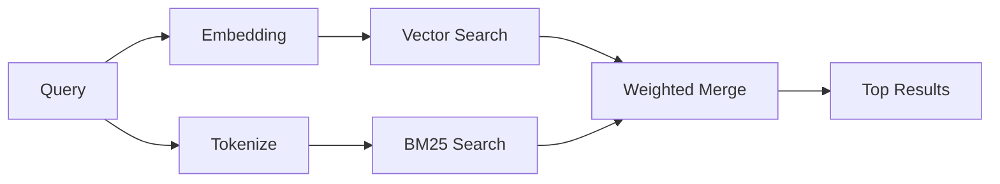

# Recherche mémoire

`memory_search` trouve les notes pertinentes de vos fichiers mémoire, même lorsque
la formulation diffère du texte original. Cela fonctionne en indexant la mémoire en petits
fragments et en les recherchant à l'aide d'embeddings, de mots-clés, ou des deux.

## Démarrage rapide

Si vous avez une clé API OpenAI, Gemini, Voyage ou Mistral configurée, la recherche mémoire
fonctionne automatiquement. Pour définir un fournisseur explicitement :

```json5
{
  agents: {
    defaults: {
      memorySearch: {
        provider: "openai", // or "gemini", "local", "ollama", etc.
      },
    },
  },
}
```

Pour les embeddings locaux sans clé API, utilisez `provider: "local"` (nécessite
node-llama-cpp).

## Fournisseurs supportés

| Fournisseur | ID        | Nécessite une clé API | Notes                         |
| -------- | --------- | ------------- | ----------------------------- |
| OpenAI   | `openai`  | Oui           | Détection automatique, rapide           |
| Gemini   | `gemini`  | Oui           | Supporte l'indexation d'images/audio |
| Voyage   | `voyage`  | Oui           | Détection automatique                 |
| Mistral  | `mistral` | Oui           | Détection automatique                 |
| Ollama   | `ollama`  | Non            | Local, doit être défini explicitement    |
| Local    | `local`   | Non            | Modèle GGUF, ~0,6 GB de téléchargement  |

## Fonctionnement de la recherche

OpenClaw exécute deux chemins de récupération en parallèle et fusionne les résultats :



- **La recherche vectorielle** trouve les notes avec un sens similaire ("gateway host" correspond à
  "la machine exécutant OpenClaw").
- **La recherche par mots-clés BM25** trouve les correspondances exactes (IDs, chaînes d'erreur, clés de configuration).

Si un seul chemin est disponible (pas d'embeddings ou pas de FTS), l'autre s'exécute seul.

## Améliorer la qualité de la recherche

Deux fonctionnalités optionnelles aident lorsque vous avez un grand historique de notes :

### Décroissance temporelle

Les notes anciennes perdent progressivement du poids de classement afin que les informations récentes apparaissent en premier.
Avec la demi-vie par défaut de 30 jours, une note du mois dernier obtient un score de 50% de
son poids d'origine. Les fichiers persistants comme `MEMORY.md` ne sont jamais décayés.

<Tip>
Activez la décroissance temporelle si votre agent a des mois de notes quotidiennes et que les informations obsolètes
continuent de surclasser le contexte récent.
</Tip>

### MMR (diversité)

Réduit les résultats redondants. Si cinq notes mentionnent toutes la même configuration de routeur, MMR
garantit que les meilleurs résultats couvrent différents sujets au lieu de se répéter.

<Tip>
Activez MMR si `memory_search` continue de retourner des extraits quasi-dupliqués provenant de
différentes notes quotidiennes.
</Tip>

### Activer les deux

```json5
{
  agents: {
    defaults: {
      memorySearch: {
        query: {
          hybrid: {
            mmr: { enabled: true },
            temporalDecay: { enabled: true },
          },
        },
      },
    },
  },
}
```

## Mémoire multimodale

Avec Gemini Embedding 2, vous pouvez indexer des images et des fichiers audio aux côtés
du Markdown. Les requêtes de recherche restent du texte, mais elles correspondent à du contenu
visuel et audio. Consultez la [référence de configuration mémoire](/fr/reference/memory-config) pour
la configuration.

## Recherche mémoire de session

Vous pouvez éventuellement indexer les transcriptions de session afin que `memory_search` puisse rappeler
les conversations antérieures. Ceci est optionnel via
`memorySearch.experimental.sessionMemory`. Consultez la
[référence de configuration](/fr/reference/memory-config) pour plus de détails.

## Dépannage

**Pas de résultats ?** Exécutez `openclaw memory status` pour vérifier l'index. S'il est vide, exécutez
`openclaw memory index --force`.

**Seulement des correspondances de mots-clés ?** Votre fournisseur d'embedding peut ne pas être configuré. Vérifiez
`openclaw memory status --deep`.

**Texte CJK non trouvé ?** Reconstruisez l'index FTS avec
`openclaw memory index --force`.

## Lectures complémentaires

- [Mémoire](/fr/concepts/memory) -- disposition des fichiers, backends, outils
- [Référence de configuration mémoire](/fr/reference/memory-config) -- tous les paramètres de configuration
