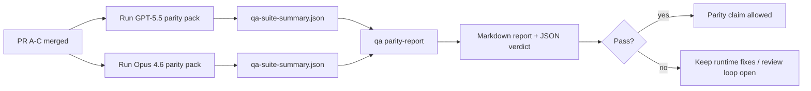

Cette note explique comment examiner le programme de parité GPT-5.5 / Codex en tant que quatre unités de fusion sans perdre l'architecture originale à six contrats.

## Unités de fusion

### PR A : exécution strictement agentique

Possède :

- `executionContract`
- suivi GPT-5-first dans le même tour
- `update_plan` comme suivi de progression non-terminal
- états explicitement bloqués au lieu d'arrêts silencieux basés sur le plan uniquement

Ne possède pas :

- classification des défaillances d'authentification/runtime
- véracité des permissions
- redesign de replay/continuation
- benchmarking de parité

### PR B : véracité du runtime

Possède :

- correction de la portée OAuth Codex
- classification typée des défaillances provider/runtime
- disponibilité et raisons de blocage de `/elevated full` véridiques

Ne possède pas :

- normalisation du schéma des outils
- état de replay/liveness
- gating du benchmark

### PR C : correction de l'exécution

Possède :

- compatibilité des outils OpenAI/Codex possédés par le provider
- gestion stricte du schéma sans paramètres
- surfaçage de replay-invalid
- visibilité de l'état paused, blocked, abandoned et long-task

Ne possède pas :

- continuation auto-élue
- comportement générique du dialecte Codex en dehors des hooks provider
- gating du benchmark

### PR D : harnais de parité

Possède :

- pack de scénarios première vague GPT-5.5 vs Opus 4.6
- documentation de parité
- mécaniques de rapport de parité et de release-gate

Ne possède pas :

- changements de comportement runtime en dehors du QA-lab
- simulation auth/proxy/DNS à l'intérieur du harnais

## Mappage vers les six contrats originaux

| Contrat original                         | Unité de fusion |
| ---------------------------------------- | --------------- |
| Correction du transport/auth du provider | PR B            |
| Compatibilité du contrat/schéma d'outil  | PR C            |
| Exécution dans le même tour              | PR A            |
| Véracité des permissions                 | PR B            |
| Correction de replay/continuation/liveness | PR C            |
| Benchmark/release gate                   | PR D            |

## Ordre de révision

1. PR A
2. PR B
3. PR C
4. PR D

PR D est la couche de preuve. Elle ne devrait pas être la raison pour laquelle les PRs de correction du runtime sont retardées.

## Ce qu'il faut rechercher

### PR A

- Les exécutions GPT-5 agissent ou échouent fermées au lieu de s'arrêter au commentaire
- `update_plan` ne ressemble plus à une progression en soi
- le comportement reste GPT-5-first et scoped embedded-Pi

### PR B

- les défaillances auth/proxy/runtime cessent de s'effondrer dans la gestion générique "model failed"
- `/elevated full` n'est décrit comme disponible que lorsqu'il l'est réellement
- les raisons de blocage sont visibles à la fois pour le modèle et le runtime côté utilisateur

### PR C

- l'enregistrement strict des outils OpenAI/Codex se comporte de manière prévisible
- les outils sans paramètres ne échouent pas les vérifications strictes du schéma
- les résultats de replay et de compaction préservent l'état liveness véridique

### PR D

- le pack de scénarios est compréhensible et reproductible
- le pack inclut une voie de sécurité replay-mutating, pas seulement des flux en lecture seule
- les rapports sont lisibles par les humains et l'automatisation
- les affirmations de parité sont soutenues par des preuves, pas anecdotiques

Artefacts attendus de PR D :

- `qa-suite-report.md` / `qa-suite-summary.json` pour chaque exécution de modèle
- `qa-agentic-parity-report.md` avec comparaison agrégée et au niveau du scénario
- `qa-agentic-parity-summary.json` avec un verdict lisible par machine

## Release gate

Ne revendiquez pas la parité GPT-5.5 ou la supériorité sur Opus 4.6 jusqu'à :

- PR A, PR B et PR C sont fusionnées
- PR D exécute le pack de parité première vague proprement
- les suites de régression runtime-truthfulness restent vertes
- le rapport de parité ne montre aucun cas de faux succès et aucune régression du comportement d'arrêt

Le harnais de parité n'est pas la seule source de preuve. Gardez cette séparation explicite dans la révision :

- PR D possède la comparaison basée sur les scénarios GPT-5.5 vs Opus 4.6
- les suites déterministes PR B possèdent toujours les preuves auth/proxy/DNS et full-access truthfulness

## Flux de fusion rapide du mainteneur

Utilisez ceci lorsque vous êtes prêt à fusionner une PR de parité et que vous voulez une séquence reproductible et à faible risque.

1. Confirmez que la barre de preuve est atteinte avant la fusion :
   - symptôme reproductible ou test échouant
   - cause racine vérifiée dans le code modifié
   - correction dans le chemin impliqué
   - test de régression ou note de vérification manuelle explicite
2. Triez/étiquetez avant la fusion :
   - appliquez les étiquettes auto-close `r:*` lorsque la PR ne devrait pas être fusionnée
   - gardez les candidats de fusion libres de threads de blocage non résolus
3. Validez localement sur la surface modifiée :
   - `pnpm check:changed`
   - `pnpm test:changed` lorsque les tests ont changé ou que la confiance de correction de bug dépend de la couverture de test
4. Fusionnez avec le flux de mainteneur standard (processus `/landpr`), puis vérifiez :
   - comportement auto-close des problèmes liés
   - CI et statut post-fusion sur `main`
5. Après la fusion, exécutez une recherche de doublons pour les PRs/problèmes ouverts connexes et fermez uniquement avec une référence canonique.

Si l'un des éléments de la barre de preuve est manquant, demandez des modifications au lieu de fusionner.

## Mappage objectif-à-preuve

| Élément de gate d'achèvement              | Propriétaire principal | Artefact de révision                                                |
| ----------------------------------------- | ---------------------- | ------------------------------------------------------------------- |
| Pas de blocages plan-only                 | PR A                   | tests runtime strictement agentiques et `approval-turn-tool-followthrough` |
| Pas de fausse progression ou fausse complétion d'outil | PR A + PR D   | compte de faux succès de parité plus détails de rapport au niveau du scénario |
| Pas de fausse guidance `/elevated full`   | PR B                   | suites déterministes runtime-truthfulness                           |
| Les défaillances replay/liveness restent explicites | PR C + PR D   | suites lifecycle/replay plus `compaction-retry-mutating-tool`       |
| GPT-5.5 correspond ou surpasse Opus 4.6   | PR D                   | `qa-agentic-parity-report.md` et `qa-agentic-parity-summary.json`   |

## Sténographie du relecteur : avant vs après

| Problème visible par l'utilisateur avant                    | Signal de révision après                                                                |
| ----------------------------------------------------------- | --------------------------------------------------------------------------------------- |
| GPT-5.5 s'est arrêté après la planification                 | PR A montre le comportement act-or-block au lieu de la complétion commentary-only        |
| L'utilisation d'outils semblait fragile avec les schémas OpenAI/Codex stricts | PR C garde l'enregistrement des outils et l'invocation sans paramètres prévisibles       |
| Les indices `/elevated full` étaient parfois trompeurs       | PR B lie la guidance à la capacité runtime réelle et aux raisons de blocage              |
| Les tâches longues pouvaient disparaître dans l'ambiguïté replay/compaction | PR C émet un état explicite paused, blocked, abandoned et replay-invalid                |
| Les affirmations de parité étaient anecdotiques             | PR D produit un rapport plus verdict JSON avec la même couverture de scénario sur les deux modèles |

## Connexes

- [Parité agentique GPT-5.5 / Codex](/fr/help/gpt55-codex-agentic-parity)
