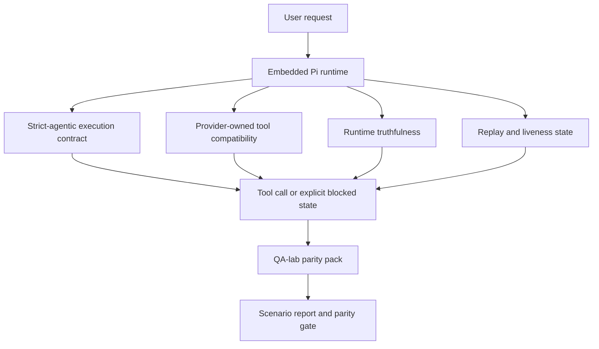
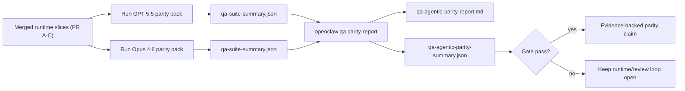

# Parité agentic GPT-5.5 / Codex dans OpenClaw

OpenClaw fonctionnait déjà bien avec les modèles frontière utilisant des outils, mais GPT-5.5 et les modèles de style Codex avaient encore des performances insuffisantes de quelques façons pratiques :

- ils pouvaient s'arrêter après la planification au lieu de faire le travail
- ils pouvaient utiliser incorrectement les schémas d'outils stricts OpenAI/Codex
- ils pouvaient demander `/elevated full` même quand l'accès complet était impossible
- ils pouvaient perdre l'état des tâches longues pendant la relecture ou la compaction
- les affirmations de parité par rapport à Claude Opus 4.6 étaient basées sur des anecdotes plutôt que sur des scénarios reproductibles

Ce programme de parité corrige ces lacunes en quatre tranches examinables.

## Ce qui a changé

### PR A : exécution strict-agentic

Cette tranche ajoute un contrat d'exécution `strict-agentic` optionnel pour les exécutions Pi GPT-5 intégrées.

Lorsqu'il est activé, OpenClaw cesse d'accepter les tours de planification uniquement comme une complétion « suffisante ». Si le modèle dit seulement ce qu'il a l'intention de faire et n'utilise pas réellement les outils ou ne fait pas de progrès, OpenClaw réessaie avec une direction « agir maintenant » puis échoue fermé avec un état explicitement bloqué au lieu de terminer silencieusement la tâche.

Cela améliore l'expérience GPT-5.5 surtout sur :

- les courtes suites « ok fais-le »
- les tâches de code où la première étape est évidente
- les flux où `update_plan` devrait être un suivi de progrès plutôt qu'un texte de remplissage

### PR B : véracité du runtime

Cette tranche fait dire la vérité à OpenClaw sur deux choses :

- pourquoi l'appel du fournisseur/runtime a échoué
- si `/elevated full` est réellement disponible

Cela signifie que GPT-5.5 obtient de meilleurs signaux de runtime pour les portées manquantes, les échecs d'actualisation d'authentification, les échecs d'authentification HTML 403, les problèmes de proxy, les défaillances DNS ou de délai d'expiration, et les modes d'accès complet bloqués. Le modèle est moins susceptible d'halluciner la mauvaise correction ou de continuer à demander un mode de permission que le runtime ne peut pas fournir.

### PR C : correction d'exécution

Cette tranche améliore deux types de correction :

- la compatibilité du schéma d'outils OpenAI/Codex détenue par le fournisseur
- la surface de relecture et de vivacité des tâches longues

Le travail de compatibilité des outils réduit les frictions de schéma pour l'enregistrement strict des outils OpenAI/Codex, en particulier autour des outils sans paramètres et des attentes strictes de racine d'objet. Le travail de relecture/vivacité rend les tâches longues plus observables, de sorte que les états en pause, bloqués et abandonnés sont visibles au lieu de disparaître dans un texte d'échec générique.

### PR D : harnais de parité

Cette tranche ajoute le premier pack de parité du laboratoire QA afin que GPT-5.5 et Opus 4.6 puissent être exercés à travers les mêmes scénarios et comparés en utilisant des preuves partagées.

Le pack de parité est la couche de preuve. Il ne change pas le comportement du runtime par lui-même.

Après avoir deux artefacts `qa-suite-summary.json`, générez la comparaison de la porte de version avec :

```bash
pnpm openclaw qa parity-report \
  --repo-root . \
  --candidate-summary .artifacts/qa-e2e/gpt55/qa-suite-summary.json \
  --baseline-summary .artifacts/qa-e2e/opus46/qa-suite-summary.json \
  --output-dir .artifacts/qa-e2e/parity
```

Cette commande écrit :

- un rapport Markdown lisible par l'homme
- un verdict lisible par machine en JSON
- un résultat de porte explicite `pass` / `fail`

## Pourquoi cela améliore GPT-5.5 en pratique

Avant ce travail, GPT-5.5 sur OpenClaw pouvait sembler moins agentic qu'Opus dans les vraies sessions de codage parce que le runtime tolérait les comportements qui sont particulièrement nuisibles pour les modèles de style GPT-5 :

- les tours de commentaire uniquement
- les frictions de schéma autour des outils
- les retours de permission vagues
- les ruptures silencieuses de relecture ou de compaction

L'objectif n'est pas de faire imiter GPT-5.5 à Opus. L'objectif est de donner à GPT-5.5 un contrat de runtime qui récompense les vrais progrès, fournit une sémantique d'outils et de permissions plus propre, et transforme les modes de défaillance en états explicites lisibles par machine et par l'homme.

Cela change l'expérience utilisateur de :

- « le modèle avait un bon plan mais s'est arrêté »

à :

- « le modèle a soit agi, soit OpenClaw a surfacé la raison exacte pour laquelle il ne pouvait pas »

## Avant et après pour les utilisateurs GPT-5.5

| Avant ce programme                                                                                 | Après PR A-D                                                                                 |
| -------------------------------------------------------------------------------------------------- | -------------------------------------------------------------------------------------------- |
| GPT-5.5 pouvait s'arrêter après un plan raisonnable sans prendre l'étape d'outil suivante          | PR A transforme « plan uniquement » en « agir maintenant ou surfacer un état bloqué »        |
| Les schémas d'outils stricts pouvaient rejeter les outils sans paramètres ou de style OpenAI/Codex de manière confuse | PR C rend l'enregistrement et l'invocation d'outils détenus par le fournisseur plus prévisibles |
| Les conseils `/elevated full` pouvaient être vagues ou incorrects dans les runtimes bloqués        | PR B donne à GPT-5.5 et à l'utilisateur des indices de runtime et de permission véridiques  |
| Les défaillances de relecture ou de compaction pouvaient sembler comme si la tâche disparaissait silencieusement | PR C surfacise explicitement les résultats en pause, bloqués, abandonnés et relecture-invalides |
| « GPT-5.5 semble pire qu'Opus » était surtout anecdotique                                         | PR D transforme cela en le même pack de scénarios, les mêmes métriques, et une porte pass/fail stricte |

## Architecture



## Flux de version



## Pack de scénarios

Le pack de parité de première vague couvre actuellement cinq scénarios :

### `approval-turn-tool-followthrough`

Vérifie que le modèle ne s'arrête pas à « Je vais faire ça » après une courte approbation. Il devrait prendre la première action concrète dans le même tour.

### `model-switch-tool-continuity`

Vérifie que le travail utilisant les outils reste cohérent à travers les limites de commutation de modèle/runtime au lieu de réinitialiser en commentaire ou de perdre le contexte d'exécution.

### `source-docs-discovery-report`

Vérifie que le modèle peut lire les sources et les documents, synthétiser les résultats et continuer la tâche de manière agentic plutôt que de produire un résumé mince et de s'arrêter tôt.

### `image-understanding-attachment`

Vérifie que les tâches en mode mixte impliquant des pièces jointes restent exploitables et ne s'effondrent pas en narration vague.

### `compaction-retry-mutating-tool`

Vérifie qu'une tâche avec une vraie écriture mutante garde l'insécurité de relecture explicite au lieu de sembler silencieusement sûre pour la relecture si l'exécution se compacte, réessaie ou perd l'état de réponse sous pression.

## Matrice de scénarios

| Scénario                           | Ce qu'il teste                                  | Bon comportement GPT-5.5                                                                   | Signal d'échec                                                                             |
| ---------------------------------- | ----------------------------------------------- | ------------------------------------------------------------------------------------------ | ------------------------------------------------------------------------------------------ |
| `approval-turn-tool-followthrough` | Tours d'approbation courts après un plan        | Démarre la première action d'outil concrète immédiatement au lieu de réaffirmer l'intention | suivi de plan uniquement, pas d'activité d'outil, ou tour bloqué sans vrai bloqueur        |
| `model-switch-tool-continuity`     | Commutation runtime/modèle sous utilisation d'outils | Préserve le contexte de tâche et continue à agir de manière cohérente                      | réinitialise en commentaire, perd le contexte d'outil, ou s'arrête après la commutation    |
| `source-docs-discovery-report`     | Lecture de source + synthèse + action           | Trouve les sources, utilise les outils et produit un rapport utile sans blocage            | résumé mince, travail d'outil manquant, ou arrêt de tour incomplet                        |
| `image-understanding-attachment`   | Travail agentic piloté par pièce jointe         | Interprète la pièce jointe, la connecte aux outils et continue la tâche                    | narration vague, pièce jointe ignorée, ou pas d'action concrète suivante                   |
| `compaction-retry-mutating-tool`   | Travail mutant sous pression de compaction      | Effectue une vraie écriture et garde l'insécurité de relecture explicite après l'effet     | l'écriture mutante se produit mais la sécurité de relecture est implicite, manquante ou contradictoire |

## Porte de version

GPT-5.5 ne peut être considéré comme étant à parité ou mieux que lorsque le runtime fusionné réussit le pack de parité et les régressions de véracité du runtime en même temps.

Résultats requis :

- pas de blocage de plan uniquement quand l'action d'outil suivante est claire
- pas de fausse complétion sans vraie exécution
- pas de conseils `/elevated full` incorrects
- pas d'abandon silencieux de relecture ou de compaction
- métriques du pack de parité au moins aussi fortes que la ligne de base Opus 4.6 convenue

Pour le harnais de première vague, la porte compare :

- le taux de complétion
- le taux d'arrêt involontaire
- le taux d'appel d'outil valide
- le nombre de faux succès

La preuve de parité est intentionnellement divisée en deux couches :

- PR D prouve le comportement GPT-5.5 vs Opus 4.6 du même scénario avec le laboratoire QA
- Les suites déterministes PR B prouvent la véracité de l'authentification, du proxy, du DNS et de `/elevated full` en dehors du harnais

## Matrice objectif-à-preuve

| Élément de porte de complétion                                           | PR propriétaire | Source de preuve                                                           | Signal de passage                                                                          |
| ------------------------------------------------------------------------ | --------------- | -------------------------------------------------------------------------- | ------------------------------------------------------------------------------------------ |
| GPT-5.5 ne s'arrête plus après la planification                          | PR A            | `approval-turn-tool-followthrough` plus suites de runtime PR A             | les tours d'approbation déclenchent un vrai travail ou un état explicitement bloqué        |
| GPT-5.5 ne simule plus le progrès ou la fausse complétion d'outil        | PR A + PR D     | résultats de scénarios de rapport de parité et nombre de faux succès       | pas de résultats de passage suspects et pas de complétion de commentaire uniquement         |
| GPT-5.5 ne donne plus de faux conseils `/elevated full`                  | PR B            | suites de véracité déterministes                                           | les raisons bloquées et les indices d'accès complet restent précis au runtime              |
| Les défaillances de relecture/vivacité restent explicites                | PR C + PR D     | suites de cycle de vie/relecture PR C plus `compaction-retry-mutating-tool` | le travail mutant garde l'insécurité de relecture explicite au lieu de disparaître silencieusement |
| GPT-5.5 correspond ou dépasse Opus 4.6 sur les métriques convenues        | PR D            | `qa-agentic-parity-report.md` et `qa-agentic-parity-summary.json`          | couverture de scénario identique et pas de régression sur la complétion, le comportement d'arrêt ou l'utilisation d'outil valide |

## Comment lire le verdict de parité

Utilisez le verdict dans `qa-agentic-parity-summary.json` comme décision finale lisible par machine pour le premier pack de parité.

- `pass` signifie que GPT-5.5 a couvert les mêmes scénarios qu'Opus 4.6 et n'a pas régressé sur les métriques agrégées convenues.
- `fail` signifie qu'au moins une barrière stricte a été déclenchée : achèvement plus faible, arrêts involontaires pires, utilisation d'outils valides plus faible, tout cas de faux succès, ou couverture de scénarios non concordante.
- « shared/base CI issue » n'est pas en soi un résultat de parité. Si le bruit CI en dehors de PR D bloque une exécution, le verdict devrait attendre une exécution de runtime fusionnée propre au lieu d'être déduit des journaux de l'ère des branches.
- L'authentification, le proxy, DNS et la véracité de `/elevated full` proviennent toujours des suites déterministes de PR B, donc la réclamation de version finale a besoin des deux : un verdict de parité PR D réussi et une couverture de véracité PR B verte.

## Qui devrait activer `strict-agentic`

Utilisez `strict-agentic` quand :

- l'agent est censé agir immédiatement quand l'étape suivante est évidente
- Les modèles GPT-5.5 ou Codex-family sont le runtime principal
- vous préférez les états bloqués explicites aux réponses « utiles » de récapitulatif uniquement

Conservez le contrat par défaut quand :

- vous voulez le comportement existant plus souple
- vous n'utilisez pas les modèles de la famille GPT-5
- vous testez des prompts plutôt que l'application du runtime

## Connexes

- [Notes de maintenance de la parité GPT-5.5 / Codex](/fr/help/gpt55-codex-agentic-parity-maintainers)
