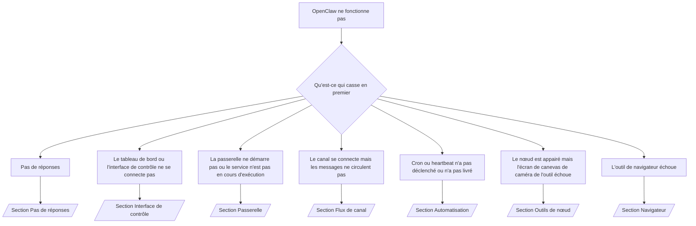

```markdown
---
summary: "Hub de dépannage basé sur les symptômes pour OpenClaw"
read_when:
  - OpenClaw ne fonctionne pas et vous avez besoin du chemin le plus rapide vers une solution
  - Vous voulez un flux de triage avant de plonger dans les runbooks détaillés
title: "Dépannage"
---

# Dépannage

Si vous n'avez que 2 minutes, utilisez cette page comme porte d'entrée de triage.

## Les 60 premières secondes

Exécutez cette échelle exacte dans l'ordre :

```bash
openclaw status
openclaw status --all
openclaw gateway probe
openclaw gateway status
openclaw doctor
openclaw channels status --probe
openclaw logs --follow
```

Bon résultat en une ligne :

- `openclaw status` → affiche les canaux configurés et aucune erreur d'authentification évidente.
- `openclaw status --all` → le rapport complet est présent et partageable.
- `openclaw gateway probe` → la cible de passerelle attendue est accessible (`Reachable: yes`). `RPC: limited - missing scope: operator.read` est un diagnostic dégradé, pas une défaillance de connexion.
- `openclaw gateway status` → `Runtime: running` et `RPC probe: ok`.
- `openclaw doctor` → aucune erreur de configuration/service bloquante.
- `openclaw channels status --probe` → les canaux signalent `connected` ou `ready`.
- `openclaw logs --follow` → activité régulière, aucune erreur fatale répétée.

## Anthropic long context 429

Si vous voyez :
`HTTP 429: rate_limit_error: Extra usage is required for long context requests`,
allez à [/gateway/troubleshooting#anthropic-429-extra-usage-required-for-long-context](/gateway/troubleshooting#anthropic-429-extra-usage-required-for-long-context).

## L'installation du plugin échoue avec des extensions openclaw manquantes

Si l'installation échoue avec `package.json missing openclaw.extensions`, le package du plugin
utilise une ancienne structure qu'OpenClaw n'accepte plus.

Correction dans le package du plugin :

1. Ajoutez `openclaw.extensions` à `package.json`.
2. Pointez les entrées vers les fichiers runtime compilés (généralement `./dist/index.js`).
3. Republier le plugin et exécuter `openclaw plugins install <npm-spec>` à nouveau.

Exemple :

```json
{
  "name": "@openclaw/my-plugin",
  "version": "1.2.3",
  "openclaw": {
    "extensions": ["./dist/index.js"]
  }
}
```

Référence : [/tools/plugin#distribution-npm](/tools/plugin#distribution-npm)

## Arbre de décision



<AccordionGroup>
  <Accordion title="Pas de réponses">
    ```bash
    openclaw status
    openclaw gateway status
    openclaw channels status --probe
    openclaw pairing list --channel <channel> [--account <id>]
    openclaw logs --follow
    ```

    Un bon résultat ressemble à :

    - `Runtime: running`
    - `RPC probe: ok`
    - Votre canal affiche connected/ready dans `channels status --probe`
    - L'expéditeur apparaît approuvé (ou la politique DM est ouverte/allowlist)

    Signatures de journal courantes :

    - `drop guild message (mention required` → le gating de mention a bloqué le message dans Discord.
    - `pairing request` → l'expéditeur n'est pas approuvé et attend l'approbation d'appairage DM.
    - `blocked` / `allowlist` dans les journaux de canal → l'expéditeur, la salle ou le groupe est filtré.

    Pages approfondies :

    - [/gateway/troubleshooting#no-replies](/gateway/troubleshooting#no-replies)
    - [/channels/troubleshooting](/channels/troubleshooting)
    - [/channels/pairing](/channels/pairing)

  </Accordion>

  <Accordion title="Le tableau de bord ou l'interface de contrôle ne se connecte pas">
    ```bash
    openclaw status
    openclaw gateway status
    openclaw logs --follow
    openclaw doctor
    openclaw channels status --probe
    ```

    Un bon résultat ressemble à :

    - `Dashboard: http://...` est affiché dans `openclaw gateway status`
    - `RPC probe: ok`
    - Aucune boucle d'authentification dans les journaux

    Signatures de journal courantes :

    - `device identity required` → le contexte HTTP/non-sécurisé ne peut pas terminer l'authentification de l'appareil.
    - `AUTH_TOKEN_MISMATCH` avec des indices de nouvelle tentative (`canRetryWithDeviceToken=true`) → une nouvelle tentative de jeton d'appareil approuvé peut se produire automatiquement.
    - `unauthorized` répété après cette nouvelle tentative → mauvais jeton/mot de passe, incompatibilité du mode d'authentification ou jeton d'appareil appairé obsolète.
    - `gateway connect failed:` → l'interface utilisateur cible la mauvaise URL/port ou la passerelle est inaccessible.

    Pages approfondies :

    - [/gateway/troubleshooting#dashboard-control-ui-connectivity](/gateway/troubleshooting#dashboard-control-ui-connectivity)
    - [/web/control-ui](/web/control-ui)
    - [/gateway/authentication](/gateway/authentication)

  </Accordion>

  <Accordion title="La passerelle ne démarre pas ou le service est installé mais ne s'exécute pas">
    ```bash
    openclaw status
    openclaw gateway status
    openclaw logs --follow
    openclaw doctor
    openclaw channels status --probe
    ```

    Un bon résultat ressemble à :

    - `Service: ... (loaded)`
    - `Runtime: running`
    - `RPC probe: ok`

    Signatures de journal courantes :

    - `Gateway start blocked: set gateway.mode=local` → le mode de passerelle n'est pas défini/distant.
    - `refusing to bind gateway ... without auth` → liaison non-loopback sans jeton/mot de passe.
    - `another gateway instance is already listening` ou `EADDRINUSE` → port déjà utilisé.

    Pages approfondies :

    - [/gateway/troubleshooting#gateway-service-not-running](/gateway/troubleshooting#gateway-service-not-running)
    - [/gateway/background-process](/gateway/background-process)
    - [/gateway/configuration](/gateway/configuration)

  </Accordion>

  <Accordion title="Le canal se connecte mais les messages ne circulent pas">
    ```bash
    openclaw status
    openclaw gateway status
    openclaw logs --follow
    openclaw doctor
    openclaw channels status --probe
    ```

    Un bon résultat ressemble à :

    - Le transport du canal est connecté.
    - Les vérifications d'appairage/allowlist réussissent.
    - Les mentions sont détectées où nécessaire.

    Signatures de journal courantes :

    - `mention required` → le gating de mention de groupe a bloqué le traitement.
    - `pairing` / `pending` → l'expéditeur DM n'est pas encore approuvé.
    - `not_in_channel`, `missing_scope`, `Forbidden`, `401/403` → problème de jeton de permission de canal.

    Pages approfondies :

    - [/gateway/troubleshooting#channel-connected-messages-not-flowing](/gateway/troubleshooting#channel-connected-messages-not-flowing)
    - [/channels/troubleshooting](/channels/troubleshooting)

  </Accordion>

  <Accordion title="Cron ou heartbeat n'a pas déclenché ou n'a pas livré">
    ```bash
    openclaw status
    openclaw gateway status
    openclaw cron status
    openclaw cron list
    openclaw cron runs --id <jobId> --limit 20
    openclaw logs --follow
    ```

    Un bon résultat ressemble à :

    - `cron.status` affiche activé avec un prochain réveil.
    - `cron runs` affiche les entrées `ok` récentes.
    - Heartbeat est activé et pas en dehors des heures actives.

    Signatures de journal courantes :

    - `cron: scheduler disabled; jobs will not run automatically` → cron est désactivé.
    - `heartbeat skipped` avec `reason=quiet-hours` → en dehors des heures actives configurées.
    - `requests-in-flight` → voie principale occupée ; le réveil du heartbeat a été différé.
    - `unknown accountId` → le compte cible de livraison du heartbeat n'existe pas.

    Pages approfondies :

    - [/gateway/troubleshooting#cron-and-heartbeat-delivery](/gateway/troubleshooting#cron-and-heartbeat-delivery)
    - [/automation/troubleshooting](/automation/troubleshooting)
    - [/gateway/heartbeat](/gateway/heartbeat)

  </Accordion>

  <Accordion title="Le nœud est appairé mais l'outil échoue à l'exécution de l'écran de canevas de caméra">
    ```bash
    openclaw status
    openclaw gateway status
    openclaw nodes status
    openclaw nodes describe --node <idOrNameOrIp>
    openclaw logs --follow
    ```

    Un bon résultat ressemble à :

    - Le nœud est listé comme connecté et appairé pour le rôle `node`.
    - La capacité existe pour la commande que vous invoquez.
    - L'état de permission est accordé pour l'outil.

    Signatures de journal courantes :

    - `NODE_BACKGROUND_UNAVAILABLE` → mettez l'application de nœud au premier plan.
    - `*_PERMISSION_REQUIRED` → la permission du système d'exploitation a été refusée/manquante.
    - `SYSTEM_RUN_DENIED: approval required` → l'approbation d'exécution est en attente.
    - `SYSTEM_RUN_DENIED: allowlist miss` → commande non sur la liste d'autorisation d'exécution.

    Pages approfondies :

    - [/gateway/troubleshooting#node-paired-tool-fails](/gateway/troubleshooting#node-paired-tool-fails)
    - [/nodes/troubleshooting](/nodes/troubleshooting)
    - [/tools/exec-approvals](/tools/exec-approvals)

  </Accordion>

  <Accordion title="L'outil de navigateur échoue">
    ```bash
    openclaw status
    openclaw gateway status
    openclaw browser status
    openclaw logs --follow
    openclaw doctor
    ```

    Un bon résultat ressemble à :

    - L'état du navigateur affiche `running: true` et un navigateur/profil choisi.
    - Le profil `openclaw` démarre ou le relais `chrome` a un onglet attaché.

    Signatures de journal courantes :

    - `Failed to start Chrome CDP on port` → le lancement du navigateur local a échoué.
    - `browser.executablePath not found` → le chemin binaire configuré est incorrect.
    - `Chrome extension relay is running, but no tab is connected` → l'extension n'est pas attachée.
    - `Browser attachOnly is enabled ... not reachable` → le profil attach-only n'a pas de cible CDP active.

    Pages approfondies :

    - [/gateway/troubleshooting#browser-tool-fails](/gateway/troubleshooting#browser-tool-fails)
    - [/tools/browser-linux-troubleshooting](/tools/browser-linux-troubleshooting)
    - [/tools/browser-wsl2-windows-remote-cdp-troubleshooting](/tools/browser-wsl2-windows-remote-cdp-troubleshooting)
    - [/tools/chrome-extension](/tools/chrome-extension)

  </Accordion>
</AccordionGroup>
```
