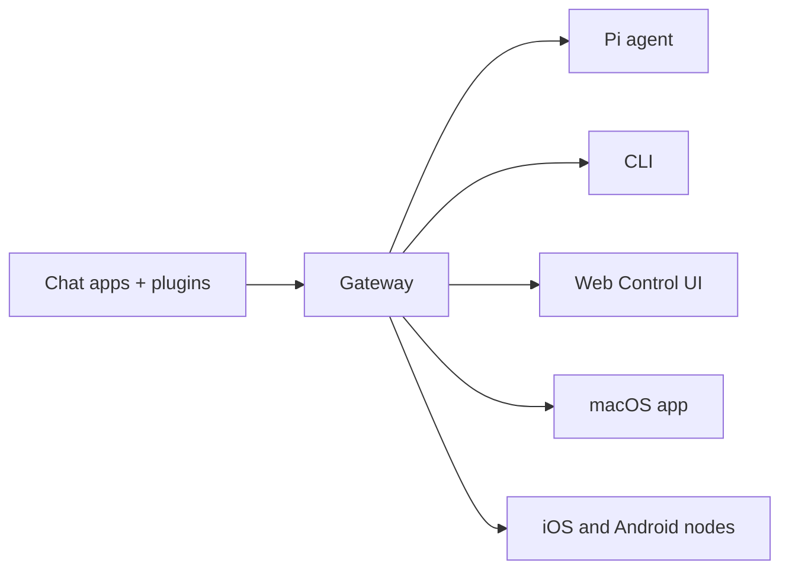

# OpenClaw 🦞

<p align="center">
    
    
</p>

> _"EXFOLIATE! EXFOLIATE!"_ — Un homard de l'espace, probablement

<p align="center">
  <strong>Passerelle multi-OS pour les agents IA sur WhatsApp, Telegram, Discord, iMessage, et plus.</strong><br />
  Envoyez un message, obtenez une réponse d'agent depuis votre poche. Les plugins ajoutent Mattermost et plus.
</p>

<Columns>
  <Card title="Commencer" href="/start/getting-started" icon="rocket">
    Installez OpenClaw et lancez la passerelle en quelques minutes.
  </Card>
  <Card title="Exécuter l'assistant" href="/start/wizard" icon="sparkles">
    Configuration guidée avec `openclaw onboard` et flux d'appairage.
  </Card>
  <Card title="Ouvrir l'interface de contrôle" href="/web/control-ui" icon="layout-dashboard">
    Lancez le tableau de bord du navigateur pour le chat, la configuration et les sessions.
  </Card>
</Columns>

## Qu'est-ce qu'OpenClaw ?

OpenClaw est une **passerelle auto-hébergée** qui connecte vos applications de chat préférées — WhatsApp, Telegram, Discord, iMessage, et plus — à des agents IA de codage comme Pi. Vous exécutez un seul processus Gateway sur votre propre machine (ou un serveur), et il devient le pont entre vos applications de messagerie et un assistant IA toujours disponible.

**Pour qui est-ce ?** Les développeurs et utilisateurs avancés qui veulent un assistant IA personnel auquel ils peuvent envoyer des messages de n'importe où — sans abandonner le contrôle de leurs données ou dépendre d'un service hébergé.

**Qu'est-ce qui le rend différent ?**

- **Auto-hébergé** : s'exécute sur votre matériel, vos règles
- **Multi-canaux** : une passerelle unique dessert WhatsApp, Telegram, Discord, et plus simultanément
- **Natif pour les agents** : conçu pour les agents de codage avec utilisation d'outils, sessions, mémoire et routage multi-agents
- **Open source** : sous licence MIT, piloté par la communauté

**De quoi avez-vous besoin ?** Node 24 (recommandé), ou Node 22 LTS (`22.16+`) pour la compatibilité, une clé API de votre fournisseur choisi, et 5 minutes. Pour la meilleure qualité et sécurité, utilisez le modèle de dernière génération le plus puissant disponible.

## Comment ça marche



La passerelle est la source unique de vérité pour les sessions, le routage et les connexions de canaux.

## Capacités clés

<Columns>
  <Card title="Passerelle multi-canaux" icon="network">
    WhatsApp, Telegram, Discord et iMessage avec un seul processus Gateway.
  </Card>
  <Card title="Canaux de plugin" icon="plug">
    Ajoutez Mattermost et plus avec des packages d'extension.
  </Card>
  <Card title="Routage multi-agents" icon="route">
    Sessions isolées par agent, espace de travail ou expéditeur.
  </Card>
  <Card title="Support des médias" icon="image">
    Envoyez et recevez des images, de l'audio et des documents.
  </Card>
  <Card title="Interface de contrôle Web" icon="monitor">
    Tableau de bord du navigateur pour le chat, la configuration, les sessions et les nœuds.
  </Card>
  <Card title="Nœuds mobiles" icon="smartphone">
    Appairez les nœuds iOS et Android pour les flux de travail Canvas, caméra et voix.
  </Card>
</Columns>

## Démarrage rapide

<Steps>
  <Step title="Installer OpenClaw">
    ```bash
    npm install -g openclaw@latest
    ```
  </Step>
  <Step title="Intégrer et installer le service">
    ```bash
    openclaw onboard --install-daemon
    ```
  </Step>
  <Step title="Appairer WhatsApp et démarrer la passerelle">
    ```bash
    openclaw channels login
    openclaw gateway --port 18789
    ```
  </Step>
</Steps>

Besoin de la configuration complète d'installation et de développement ? Voir [Démarrage rapide](/start/quickstart).

## Tableau de bord

Ouvrez l'interface de contrôle du navigateur après le démarrage de la passerelle.

- Par défaut local : [http://127.0.0.1:18789/](http://127.0.0.1:18789/)
- Accès à distance : [Surfaces Web](/web) et [Tailscale](/gateway/tailscale)

<p align="center">
  
</p>

## Configuration (optionnel)

La configuration se trouve à `~/.openclaw/openclaw.json`.

- Si vous **ne faites rien**, OpenClaw utilise le binaire Pi fourni en mode RPC avec des sessions par expéditeur.
- Si vous voulez le verrouiller, commencez par `channels.whatsapp.allowFrom` et (pour les groupes) les règles de mention.

Exemple :

```json5
{
  channels: {
    whatsapp: {
      allowFrom: ["+15555550123"],
      groups: { "*": { requireMention: true } },
    },
  },
  messages: { groupChat: { mentionPatterns: ["@openclaw"] } },
}
```

## Commencer ici

<Columns>
  <Card title="Hubs de documentation" href="/start/hubs" icon="book-open">
    Toute la documentation et les guides, organisés par cas d'usage.
  </Card>
  <Card title="Configuration" href="/gateway/configuration" icon="settings">
    Paramètres de passerelle principaux, jetons et configuration du fournisseur.
  </Card>
  <Card title="Accès à distance" href="/gateway/remote" icon="globe">
    Modèles d'accès SSH et tailnet.
  </Card>
  <Card title="Canaux" href="/channels/telegram" icon="message-square">
    Configuration spécifique aux canaux pour WhatsApp, Telegram, Discord, et plus.
  </Card>
  <Card title="Nœuds" href="/nodes" icon="smartphone">
    Nœuds iOS et Android avec appairage, Canvas, caméra et actions d'appareil.
  </Card>
  <Card title="Aide" href="/help" icon="life-buoy">
    Corrections courantes et point d'entrée de dépannage.
  </Card>
</Columns>

## En savoir plus

<Columns>
  <Card title="Liste complète des fonctionnalités" href="/concepts/features" icon="list">
    Capacités complètes de canal, routage et médias.
  </Card>
  <Card title="Routage multi-agents" href="/concepts/multi-agent" icon="route">
    Isolation de l'espace de travail et sessions par agent.
  </Card>
  <Card title="Sécurité" href="/gateway/security" icon="shield">
    Jetons, listes blanches et contrôles de sécurité.
  </Card>
  <Card title="Dépannage" href="/gateway/troubleshooting" icon="wrench">
    Diagnostics de passerelle et erreurs courantes.
  </Card>
  <Card title="À propos et crédits" href="/reference/credits" icon="info">
    Origines du projet, contributeurs et licence.
  </Card>
</Columns>
