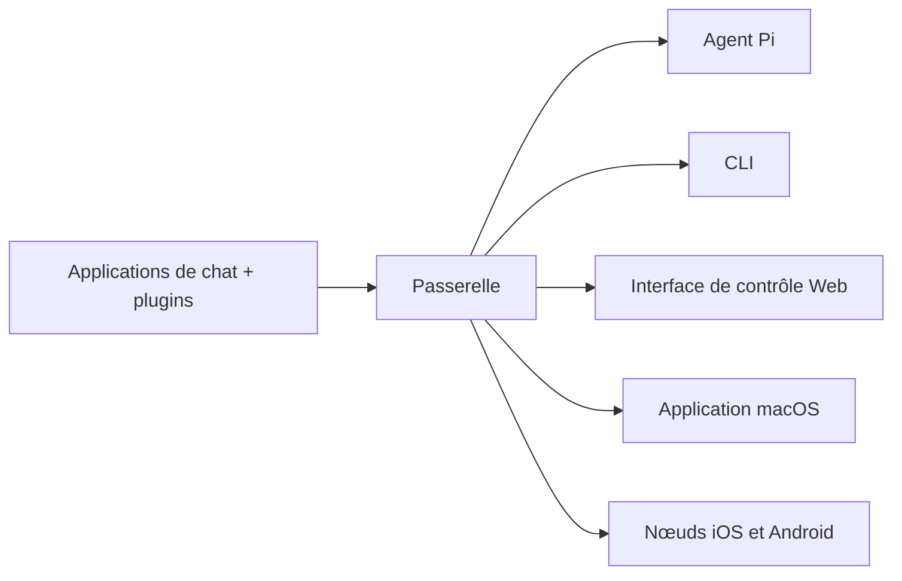

---
read_when:
  - 新規ユーザーにOpenClawを紹介するとき
summary: OpenClawは、あらゆるOSで動作するAIエージェント向けのマルチチャネルgatewayです。
title: OpenClaw
x-i18n:
  generated_at: "2026-02-08T17:15:47Z"
  model: claude-opus-4-5
  provider: pi
  source_hash: fc8babf7885ef91d526795051376d928599c4cf8aff75400138a0d7d9fa3b75f
  source_path: index.md
  workflow: 15
---

# OpenClaw 🦞

<p align="center">
    
    
</p>

> _« EXFOLIATE! EXFOLIATE! »_ — probablement un homard cosmique

<p align="center">
  <strong>Une passerelle d'agent IA pour tous les systèmes d'exploitation, compatible avec WhatsApp, Telegram, Discord, iMessage, et bien d'autres.</strong><br />
  Envoyez un message et recevez la réponse de l'agent directement dans votre poche. Ajoutez Mattermost et d'autres services via des plugins.
</p>

<Columns>
  <Card title="Démarrage" href="/start/getting-started" icon="rocket">
    Installez OpenClaw et lancez la passerelle en quelques minutes.
  </Card>
  <Card title="Exécuter l'assistant" href="/start/wizard" icon="sparkles">
    `openclaw onboard` avec un flux d'appairage guidé.
  </Card>
  <Card title="Ouvrir l'interface de contrôle" href="/web/control-ui" icon="layout-dashboard">
    Lancez le tableau de bord du navigateur pour le chat, les paramètres et les sessions.
  </Card>
</Columns>

OpenClaw connecte les applications de chat aux agents de codage comme Pi via une seule passerelle. Il alimente l'assistant OpenClaw et prend en charge les configurations locales ou distantes.

## Comment ça marche



La passerelle est la source unique de vérité pour les sessions, le routage et les connexions de canaux.

## Fonctionnalités principales

<Columns>
  <Card title="Passerelle multi-canaux" icon="network">
    Support de WhatsApp, Telegram, Discord et iMessage via une seule passerelle.
  </Card>
  <Card title="Canaux par plugin" icon="plug">
    Ajoutez Mattermost et d'autres services via des packages d'extension.
  </Card>
  <Card title="Routage multi-agents" icon="route">
    Sessions séparées par agent, espace de travail et expéditeur.
  </Card>
  <Card title="Support des médias" icon="image">
    Envoyez et recevez des images, de l'audio et des documents.
  </Card>
  <Card title="Interface de contrôle Web" icon="monitor">
    Tableau de bord du navigateur pour le chat, les paramètres, les sessions et les nœuds.
  </Card>
  <Card title="Nœuds mobiles" icon="smartphone">
    Appairez les nœuds iOS et Android compatibles avec Canvas.
  </Card>
</Columns>

## Démarrage rapide

<Steps>
  <Step title="Installer OpenClaw">
    ```bash
    npm install -g openclaw@latest
    ```
  </Step>
  <Step title="Intégration et installation du service">
    ```bash
    openclaw onboard --install-daemon
    ```
  </Step>
  <Step title="Appairer WhatsApp et lancer la passerelle">
    ```bash
    openclaw channels login
    openclaw gateway --port 18789
    ```
  </Step>
</Steps>

Besoin d'une installation complète et d'une configuration de développement ? Consultez le [démarrage rapide](/start/quickstart).

## Tableau de bord

Après le lancement de la passerelle, ouvrez l'interface de contrôle dans votre navigateur.

- Par défaut local : [http://127.0.0.1:18789/](http://127.0.0.1:18789/)
- Accès distant : [Surface Web](/web) et [Tailscale](/gateway/tailscale)

<p align="center">
  
</p>

## Configuration (optionnel)

La configuration se trouve dans `~/.openclaw/openclaw.json`.

- **Si vous ne faites rien**, OpenClaw utilisera le binaire Pi fourni en mode RPC et créera des sessions par expéditeur.
- Si vous souhaitez imposer des restrictions, commencez par `channels.whatsapp.allowFrom` et les règles de mention (pour les groupes).

Exemple :

```json5
{
  channels: {
    whatsapp: {
      allowFrom: ["+15555550123"],
      groups: { "*": { requireMention: true } },
    },
  },
  messages: { groupChat: { mentionPatterns: ["@openclaw"] } },
}
```

## Commencer ici

<Columns>
  <Card title="Hub de documentation" href="/start/hubs" icon="book-open">
    Toute la documentation et les guides organisés par cas d'usage.
  </Card>
  <Card title="Configuration" href="/gateway/configuration" icon="settings">
    Configuration principale de la passerelle, jetons et paramètres des fournisseurs.
  </Card>
  <Card title="Accès distant" href="/gateway/remote" icon="globe">
    Modèles d'accès SSH et tailnet.
  </Card>
  <Card title="Canaux" href="/channels/telegram" icon="message-square">
    Configuration spécifique aux canaux pour WhatsApp, Telegram, Discord, etc.
  </Card>
  <Card title="Nœuds" href="/nodes" icon="smartphone">
    Appairage et nœuds iOS et Android compatibles avec Canvas.
  </Card>
  <Card title="Aide" href="/help" icon="life-buoy">
    Point d'entrée pour les correctifs courants et le dépannage.
  </Card>
</Columns>

## En savoir plus

<Columns>
  <Card title="Liste complète des fonctionnalités" href="/concepts/features" icon="list">
    Liste complète des canaux, du routage et des fonctionnalités multimédias.
  </Card>
  <Card title="Routage multi-agents" href="/concepts/multi-agent" icon="route">
    Isolation des espaces de travail et sessions par agent.
  </Card>
  <Card title="Sécurité" href="/gateway/security" icon="shield">
    Jetons, listes blanches et contrôles de sécurité.
  </Card>
  <Card title="Dépannage" href="/gateway/troubleshooting" icon="wrench">
    Diagnostic de la passerelle et erreurs courantes.
  </Card>
  <Card title="Aperçu et crédits" href="/reference/credits" icon="info">
    Origines du projet, contributeurs et licence.
  </Card>
</Columns>
