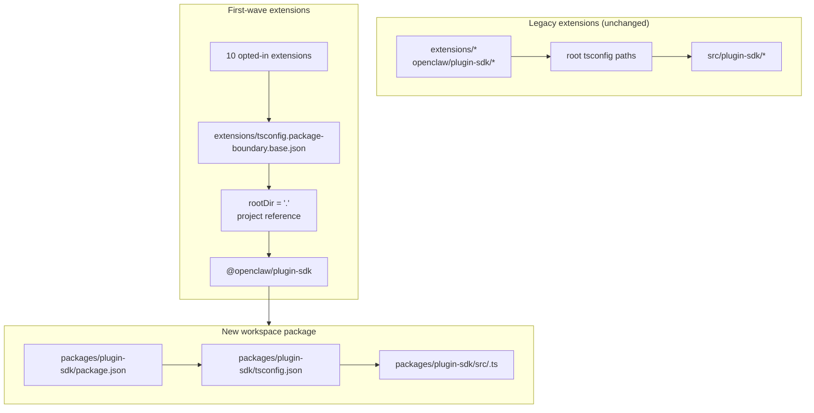

# refactor: Make plugin-sdk a real workspace package incrementally

## Overview

Ce plan introduit un vrai package workspace pour le plugin SDK à
`packages/plugin-sdk` et l'utilise pour opter dans une petite première vague d'extensions pour des limites de package appliquées par le compilateur. L'objectif est de faire échouer les imports relatifs illégaux sous `tsc` normal pour un ensemble sélectionné d'extensions de fournisseur groupées, sans forcer une migration à l'échelle du repo ou une grande surface de conflits de fusion.

Le mouvement clé incrémental est d'exécuter deux modes en parallèle pendant un certain temps :

| Mode        | Forme d'import           | Qui l'utilise                       | Application                                  |
| ----------- | ------------------------ | ------------------------------------ | -------------------------------------------- |
| Mode legacy | `openclaw/plugin-sdk/*`  | toutes les extensions non optées-in | le comportement permissif actuel reste       |
| Mode opt-in | `@openclaw/plugin-sdk/*` | extensions de première vague uniquement | `rootDir` local au package + références de projet |

## Problem Frame

Le repo actuel exporte une grande surface publique de plugin SDK, mais ce n'est pas un vrai package workspace. À la place :

- le `tsconfig.json` racine mappe `openclaw/plugin-sdk/*` directement à
  `src/plugin-sdk/*.ts`
- les extensions qui n'ont pas été optées dans l'expérience précédente partagent toujours ce comportement d'alias source global
- ajouter `rootDir` ne fonctionne que lorsque les imports SDK autorisés cessent de se résoudre en source brute du repo

Cela signifie que le repo peut décrire la politique de limite souhaitée, mais TypeScript ne l'applique pas proprement pour la plupart des extensions.

Vous voulez un chemin incrémental qui :

- rend `plugin-sdk` réel
- déplace le SDK vers un package workspace nommé `@openclaw/plugin-sdk`
- change seulement environ 10 extensions dans la première PR
- laisse le reste de l'arborescence d'extension sur l'ancien schéma jusqu'au nettoyage ultérieur
- évite le workflow `tsconfig.plugin-sdk.dts.json` + postinstall-generated declaration comme mécanisme principal pour le lancement de la première vague

## Requirements Trace

- R1. Créer un vrai package workspace pour le plugin SDK sous `packages/`.
- R2. Nommer le nouveau package `@openclaw/plugin-sdk`.
- R3. Donner au nouveau package SDK son propre `package.json` et `tsconfig.json`.
- R4. Garder les imports legacy `openclaw/plugin-sdk/*` fonctionnels pour les extensions non optées-in pendant la fenêtre de migration.
- R5. Opter dans seulement une petite première vague d'extensions dans la première PR.
- R6. Les extensions de première vague doivent échouer fermées pour les imports relatifs qui quittent leur racine de package.
- R7. Les extensions de première vague doivent consommer le SDK via une dépendance de package et une référence de projet TS, pas via des alias `paths` racine.
- R8. Le plan doit éviter une étape de génération postinstall obligatoire à l'échelle du repo pour la correction de l'éditeur.
- R9. Le lancement de la première vague doit être examinable et fusionnable comme une PR modérée, pas un refactor de 300+ fichiers à l'échelle du repo.

## Scope Boundaries

- Pas de migration complète de toutes les extensions groupées dans la première PR.
- Pas d'exigence de supprimer `src/plugin-sdk` dans la première PR.
- Pas d'exigence de recâbler chaque chemin de build ou de test racine pour utiliser le nouveau package immédiatement.
- Pas de tentative de forcer les squiggles VS Code pour chaque extension non optée-in.
- Pas de nettoyage lint large pour le reste de l'arborescence d'extension.
- Pas de grands changements de comportement runtime au-delà de la résolution d'import, de la propriété du package, et de l'application des limites pour les extensions optées-in.

## Context & Research

### Relevant Code and Patterns

- `pnpm-workspace.yaml` inclut déjà `packages/*` et `extensions/*`, donc un nouveau package workspace sous `packages/plugin-sdk` s'adapte à la disposition existante du repo.
- Les packages workspace existants tels que `packages/memory-host-sdk/package.json` et `packages/plugin-package-contract/package.json` utilisent déjà des cartes `exports` locales au package enracinées dans `src/*.ts`.
- Le `package.json` racine publie actuellement la surface SDK via `./plugin-sdk` et `./plugin-sdk/*` exports sauvegardés par `dist/plugin-sdk/*.js` et `dist/plugin-sdk/*.d.ts`.
- `src/plugin-sdk/entrypoints.ts` et `scripts/lib/plugin-sdk-entrypoints.json` agissent déjà comme l'inventaire canonique des points d'entrée pour la surface SDK.
- Le `tsconfig.json` racine mappe actuellement :
  - `openclaw/plugin-sdk` -> `src/plugin-sdk/index.ts`
  - `openclaw/plugin-sdk/*` -> `src/plugin-sdk/*.ts`
- L'expérience de limite précédente a montré que `rootDir` local au package fonctionne pour les imports relatifs illégaux seulement après que les imports SDK autorisés cessent de se résoudre en source brute en dehors du package d'extension.

### First-Wave Extension Set

Ce plan suppose que la première vague est l'ensemble lourd en fournisseurs qui est le moins susceptible de traîner des cas limites complexes de runtime de canal :

- `extensions/anthropic`
- `extensions/exa`
- `extensions/firecrawl`
- `extensions/groq`
- `extensions/mistral`
- `extensions/openai`
- `extensions/perplexity`
- `extensions/tavily`
- `extensions/together`
- `extensions/xai`

### First-Wave SDK Surface Inventory

Les extensions de première vague importent actuellement un sous-ensemble gérable de chemins SDK. Le package `@openclaw/plugin-sdk` initial n'a besoin de couvrir que ceux-ci :

- `agent-runtime`
- `cli-runtime`
- `config-runtime`
- `core`
- `image-generation`
- `media-runtime`
- `media-understanding`
- `plugin-entry`
- `plugin-runtime`
- `provider-auth`
- `provider-auth-api-key`
- `provider-auth-login`
- `provider-auth-runtime`
- `provider-catalog-shared`
- `provider-entry`
- `provider-http`
- `provider-model-shared`
- `provider-onboard`
- `provider-stream-family`
- `provider-stream-shared`
- `provider-tools`
- `provider-usage`
- `provider-web-fetch`
- `provider-web-search`
- `realtime-transcription`
- `realtime-voice`
- `runtime-env`
- `secret-input`
- `security-runtime`
- `speech`
- `testing`

### Institutional Learnings

- Aucune entrée `docs/solutions/` pertinente n'était présente dans cet arborescence de travail.

### External References

- Aucune recherche externe n'était nécessaire pour ce plan. Le repo contient déjà les patterns pertinents de package workspace et d'export SDK.

## Key Technical Decisions

- Introduire `@openclaw/plugin-sdk` comme un nouveau package workspace tout en gardant la surface legacy racine `openclaw/plugin-sdk/*` vivante pendant la migration.
  Justification : cela permet à un ensemble d'extension de première vague de passer à la résolution de package réelle sans forcer chaque extension et chaque chemin de build racine à changer à la fois.

- Utiliser une config de base de limite opt-in dédiée telle que
  `extensions/tsconfig.package-boundary.base.json` au lieu de remplacer la base d'extension existante pour tout le monde.
  Justification : le repo doit supporter à la fois les modes d'extension legacy et opt-in simultanément pendant la migration.

- Utiliser les références de projet TS des extensions de première vague à
  `packages/plugin-sdk/tsconfig.json` et définir
  `disableSourceOfProjectReferenceRedirect` pour le mode de limite opt-in.
  Justification : cela donne à `tsc` un vrai graphe de package tout en décourageant le fallback de l'éditeur et du compilateur à la traversée de source brute.

- Garder `@openclaw/plugin-sdk` privé dans la première vague.
  Justification : l'objectif immédiat est l'application des limites internes et la sécurité de la migration, pas la publication d'un second contrat SDK externe avant que la surface soit stable.

- Déplacer seulement les chemins SDK de première vague dans la première tranche d'implémentation, et garder des ponts de compatibilité pour le reste.
  Justification : déplacer physiquement tous les 315 fichiers `src/plugin-sdk/*.ts` dans une PR est exactement la surface de conflit de fusion que ce plan essaie d'éviter.

- Ne pas compter sur `scripts/postinstall-bundled-plugins.mjs` pour construire les déclarations SDK pour la première vague.
  Justification : les flux de build/référence explicites sont plus faciles à raisonner et gardent le comportement du repo plus prévisible.

## Open Questions

### Resolved During Planning

- Quelles extensions doivent être dans la première vague ?
  Utilisez les 10 extensions fournisseur/web-search listées ci-dessus car elles sont plus structurellement isolées que les packages de canal plus lourds.

- La première PR doit-elle remplacer l'arborescence d'extension entière ?
  Non. La première PR doit supporter deux modes en parallèle et opter seulement dans la première vague.

- La première vague doit-elle exiger une construction de déclaration postinstall ?
  Non. Le graphe de package/référence doit être explicite, et CI doit exécuter la vérification de type locale du package intentionnellement.

### Deferred to Implementation

- Si le package de première vague peut pointer directement à `src/*.ts` local au package via des références de projet seules, ou si une petite étape d'émission de déclaration est toujours requise pour le package `@openclaw/plugin-sdk`.
  C'est une question de validation de graphe TS détenue par l'implémentation.

- Si le package racine `openclaw` doit proxifier les chemins SDK de première vague aux sorties `packages/plugin-sdk` immédiatement ou continuer à utiliser les shims de compatibilité générés sous `src/plugin-sdk`.
  C'est un détail de compatibilité et de forme de build qui dépend du chemin d'implémentation minimal qui garde CI vert.

## High-Level Technical Design

> Ceci illustre l'approche prévue et est une orientation directionnelle pour l'examen, pas une spécification d'implémentation. L'agent implémentant doit le traiter comme du contexte, pas du code à reproduire.

## Unités d'implémentation

- [ ] **Unité 1 : Introduire le vrai package d'espace de travail `@openclaw/plugin-sdk`**

**Objectif :** Créer un vrai package d'espace de travail pour le SDK qui peut posséder
la surface de sous-chemin de première vague sans forcer une migration à l'échelle du repo.

**Exigences :** R1, R2, R3, R8, R9

**Dépendances :** Aucune

**Fichiers :**

- Créer : `packages/plugin-sdk/package.json`
- Créer : `packages/plugin-sdk/tsconfig.json`
- Créer : `packages/plugin-sdk/src/index.ts`
- Créer : `packages/plugin-sdk/src/*.ts` pour les sous-chemins SDK de première vague
- Modifier : `pnpm-workspace.yaml` uniquement si des ajustements de package-glob sont nécessaires
- Modifier : `package.json`
- Modifier : `src/plugin-sdk/entrypoints.ts`
- Modifier : `scripts/lib/plugin-sdk-entrypoints.json`
- Tester : `src/plugins/contracts/plugin-sdk-workspace-package.contract.test.ts`

**Approche :**

- Ajouter un nouveau package d'espace de travail nommé `@openclaw/plugin-sdk`.
- Commencer avec les sous-chemins SDK de première vague uniquement, pas l'arborescence entière de 315 fichiers.
- Si le déplacement direct d'un point d'entrée de première vague créerait un diff surdimensionné, la
  première PR peut introduire ce sous-chemin dans `packages/plugin-sdk/src` comme un mince
  wrapper de package d'abord, puis basculer la source de vérité vers le package dans une
  PR de suivi pour ce cluster de sous-chemin.
- Réutiliser la machinerie d'inventaire de point d'entrée existante afin que la surface de package de première vague
  soit déclarée dans un seul endroit canonique.
- Garder les exports du package racine vivants pour les utilisateurs hérités tandis que le package d'espace de travail
  devient le nouveau contrat opt-in.

**Motifs à suivre :**

- `packages/memory-host-sdk/package.json`
- `packages/plugin-package-contract/package.json`
- `src/plugin-sdk/entrypoints.ts`

**Scénarios de test :**

- Chemin heureux : le package d'espace de travail exporte chaque sous-chemin de première vague listé dans
  le plan et aucun export de première vague requis n'est manquant.
- Cas limite : les métadonnées d'export de package restent stables lorsque la liste d'entrée de première vague
  est régénérée ou comparée à l'inventaire canonique.
- Intégration : les exports SDK hérités du package racine restent présents après l'introduction
  du nouveau package d'espace de travail.

**Vérification :**

- Le repo contient un package d'espace de travail `@openclaw/plugin-sdk` valide avec une
  carte d'export de première vague stable et aucune régression d'export hérité dans la racine
  `package.json`.

- [ ] **Unité 2 : Ajouter un mode de limite TS opt-in pour les extensions appliquées par package**

**Objectif :** Définir le mode de configuration TS que les extensions opt-in utiliseront,
tout en laissant le comportement TS d'extension existant inchangé pour tous les autres.

**Exigences :** R4, R6, R7, R8, R9

**Dépendances :** Unité 1

**Fichiers :**

- Créer : `extensions/tsconfig.package-boundary.base.json`
- Créer : `tsconfig.boundary-optin.json`
- Modifier : `extensions/xai/tsconfig.json`
- Modifier : `extensions/openai/tsconfig.json`
- Modifier : `extensions/anthropic/tsconfig.json`
- Modifier : `extensions/mistral/tsconfig.json`
- Modifier : `extensions/groq/tsconfig.json`
- Modifier : `extensions/together/tsconfig.json`
- Modifier : `extensions/perplexity/tsconfig.json`
- Modifier : `extensions/tavily/tsconfig.json`
- Modifier : `extensions/exa/tsconfig.json`
- Modifier : `extensions/firecrawl/tsconfig.json`
- Tester : `src/plugins/contracts/extension-package-project-boundaries.test.ts`
- Tester : `test/extension-package-tsc-boundary.test.ts`

**Approche :**

- Laisser `extensions/tsconfig.base.json` en place pour les extensions héritées.
- Ajouter une nouvelle configuration de base opt-in qui :
  - définit `rootDir: "."`
  - référence `packages/plugin-sdk`
  - active `composite`
  - désactive la redirection de source de référence de projet si nécessaire
- Ajouter une configuration de solution dédiée pour le graphe de vérification de type de première vague au lieu de
  remodeler le projet TS du repo racine dans la même PR.

**Note d'exécution :** Commencer avec une vérification de type canary locale au package pour une
extension opt-in avant d'appliquer le motif à tous les 10.

**Motifs à suivre :**

- Motif `tsconfig.json` d'extension locale existant du travail de limite antérieur
- Motif de package d'espace de travail de `packages/memory-host-sdk`

**Scénarios de test :**

- Chemin heureux : chaque extension opt-in se vérifie avec succès via la
  configuration TS de limite de package.
- Chemin d'erreur : une importation relative canary de `../../src/cli/acp-cli.ts` échoue
  avec `TS6059` pour une extension opt-in.
- Intégration : les extensions non opt-in restent inchangées et n'ont pas besoin de
  participer à la nouvelle configuration de solution.

**Vérification :**

- Il existe un graphe de vérification de type dédié pour les 10 extensions opt-in, et les mauvaises
  importations relatives de l'une d'elles échouent via `tsc` normal.

- [ ] **Unité 3 : Migrer les extensions de première vague vers `@openclaw/plugin-sdk`**

**Objectif :** Changer les extensions de première vague pour consommer le vrai package SDK
via les métadonnées de dépendance, les références de projet et les importations de nom de package.

**Exigences :** R5, R6, R7, R9

**Dépendances :** Unité 2

**Fichiers :**

- Modifier : `extensions/anthropic/package.json`
- Modifier : `extensions/exa/package.json`
- Modifier : `extensions/firecrawl/package.json`
- Modifier : `extensions/groq/package.json`
- Modifier : `extensions/mistral/package.json`
- Modifier : `extensions/openai/package.json`
- Modifier : `extensions/perplexity/package.json`
- Modifier : `extensions/tavily/package.json`
- Modifier : `extensions/together/package.json`
- Modifier : `extensions/xai/package.json`
- Modifier : les importations de production et de test sous chacune des 10 racines d'extension qui
  référencent actuellement `openclaw/plugin-sdk/*`

**Approche :**

- Ajouter `@openclaw/plugin-sdk: workspace:*` aux `devDependencies` de l'extension de première vague.
- Remplacer les importations `openclaw/plugin-sdk/*` dans ces packages par
  `@openclaw/plugin-sdk/*`.
- Garder les importations internes à l'extension locale sur les barils locaux tels que `./api.ts` et
  `./runtime-api.ts`.
- Ne pas changer les extensions non opt-in dans cette PR.

**Motifs à suivre :**

- Barils d'importation locaux à l'extension (`api.ts`, `runtime-api.ts`)
- Forme de dépendance de package utilisée par d'autres packages d'espace de travail `@openclaw/*`

**Scénarios de test :**

- Chemin heureux : chaque extension migrée s'enregistre/charge toujours via ses tests de plugin existants après
  la réécriture d'importation.
- Cas limite : les importations SDK de test uniquement dans l'ensemble d'extension opt-in se résolvent
  toujours correctement via le nouveau package.
- Intégration : les extensions migrées ne nécessitent pas d'alias `openclaw/plugin-sdk/*`
  racine pour la vérification de type.

**Vérification :**

- Les extensions de première vague se construisent et testent contre `@openclaw/plugin-sdk`
  sans avoir besoin du chemin d'alias SDK racine hérité.

- [ ] **Unité 4 : Préserver la compatibilité héritée tandis que la migration est partielle**

**Objectif :** Garder le reste du repo fonctionnant tandis que le SDK existe sous les deux formes héritée et
nouvelle pendant la migration.

**Exigences :** R4, R8, R9

**Dépendances :** Unités 1-3

**Fichiers :**

- Modifier : `src/plugin-sdk/*.ts` pour les shims de compatibilité de première vague si nécessaire
- Modifier : `package.json`
- Modifier : la plomberie de construction ou d'export qui assemble les artefacts SDK
- Tester : `src/plugins/contracts/plugin-sdk-runtime-api-guardrails.test.ts`
- Tester : `src/plugins/contracts/plugin-sdk-index.bundle.test.ts`

**Approche :**

- Garder `openclaw/plugin-sdk/*` racine comme la surface de compatibilité pour les extensions héritées
  et pour les consommateurs externes qui ne se déplacent pas encore.
- Utiliser soit des shims générés soit du câblage de proxy d'export racine pour les sous-chemins de première vague
  qui ont été déplacés dans `packages/plugin-sdk`.
- Ne pas tenter de retirer la surface SDK racine dans cette phase.

**Motifs à suivre :**

- Génération d'export SDK racine existante via `src/plugin-sdk/entrypoints.ts`
- Compatibilité d'export de package existante dans la racine `package.json`

**Scénarios de test :**

- Chemin heureux : une importation SDK racine héritée se résout toujours pour une extension non opt-in
  après l'existence du nouveau package.
- Cas limite : un sous-chemin de première vague fonctionne via la surface racine héritée et
  la surface de nouveau package pendant la fenêtre de migration.
- Intégration : les tests de contrat d'index/bundle plugin-sdk continuent de voir une
  surface publique cohérente.

**Vérification :**

- Le repo supporte les deux modes de consommation SDK hérité et opt-in sans
  casser les extensions inchangées.

- [ ] **Unité 5 : Ajouter l'application scoped et documenter le contrat de migration**

**Objectif :** Atterrir les conseils CI et contributeur qui appliquent le nouveau comportement pour la
première vague sans prétendre que l'arborescence d'extension entière est migrée.

**Exigences :** R5, R6, R8, R9

**Dépendances :** Unités 1-4

**Fichiers :**

- Modifier : `package.json`
- Modifier : les fichiers de workflow CI qui doivent exécuter la vérification de type de limite opt-in
- Modifier : `AGENTS.md`
- Modifier : `docs/plugins/sdk-overview.md`
- Modifier : `docs/plugins/sdk-entrypoints.md`
- Modifier : `docs/plans/2026-04-05-001-refactor-extension-package-resolution-boundary-plan.md`

**Approche :**

- Ajouter une porte de première vague explicite, telle qu'une exécution de solution `tsc -b` dédiée pour
  `packages/plugin-sdk` plus les 10 extensions opt-in.
- Documenter que le repo supporte maintenant les deux modes d'extension hérité et opt-in,
  et que le nouveau travail de limite d'extension devrait préférer la nouvelle route de package.
- Enregistrer la règle de migration de prochaine vague afin que les PR ultérieures puissent ajouter plus d'extensions
  sans relitiger l'architecture.

**Motifs à suivre :**

- Tests de contrat existants sous `src/plugins/contracts/`
- Mises à jour de docs existantes qui expliquent les migrations par étapes

**Scénarios de test :**

- Chemin heureux : la nouvelle porte de vérification de type de première vague passe pour le package d'espace de travail
  et les extensions opt-in.
- Chemin d'erreur : introduire une nouvelle importation relative illégale dans une extension opt-in
  échoue la porte de vérification de type scoped.
- Intégration : CI ne nécessite pas que les extensions non opt-in satisfassent le nouveau
  mode de limite de package encore.

**Vérification :**

- Le chemin d'application de première vague est documenté, testé et exécutable sans
  forcer l'arborescence d'extension entière à migrer.

## Impact à l'échelle du système

- **Graphe d'interaction :** ce travail touche la source de vérité SDK, les exports du package racine,
  les métadonnées du package d'extension, la disposition du graphe TS et la vérification CI.
- **Propagation d'erreur :** le mode d'échec prévu devient les erreurs TS au moment de la compilation (`TS6059`)
  dans les extensions opt-in au lieu des échecs de script personnalisé uniquement.
- **Risques du cycle de vie d'état :** la migration de surface double introduit un risque de dérive entre
  les exports de compatibilité racine et le nouveau package d'espace de travail.
- **Parité de surface API :** les sous-chemins de première vague doivent rester sémantiquement identiques
  via `openclaw/plugin-sdk/*` et `@openclaw/plugin-sdk/*` pendant la transition.
- **Couverture d'intégration :** les tests unitaires ne suffisent pas ; les vérifications de type de graphe de package scoped
  sont requises pour prouver la limite.
- **Invariants inchangés :** les extensions non opt-in gardent leur comportement actuel
  dans la PR 1. Ce plan ne prétend pas à l'application de limite d'importation à l'échelle du repo.

## Risques et dépendances

| Risque                                                                                                   | Atténuation                                                                                                              |
| ------------------------------------------------------------------------------------------------------ | ----------------------------------------------------------------------------------------------------------------------- |
| Le package de première vague se résout toujours en source brute et `rootDir` ne ferme pas réellement | Faire de la première étape d'implémentation un canary de référence de package sur une extension opt-in avant d'élargir à l'ensemble complet |
| Déplacer trop de source SDK à la fois recrée le problème de conflit de fusion original                       | Déplacer uniquement les sous-chemins de première vague dans la première PR et garder les ponts de compatibilité racine                                   |
| Les surfaces SDK héritée et nouvelle dérivent sémantiquement                                                                         | Garder un inventaire de point d'entrée unique, ajouter des tests de contrat de compatibilité et rendre la parité de surface double explicite             |
| Les chemins de construction/test du repo racine commencent accidentellement à dépendre du nouveau package de manière incontrôlée        | Utiliser une configuration de solution opt-in dédiée et garder les changements de topologie TS à l'échelle du repo hors de la première PR                       |

## Livraison par phases

### Phase 1

- Introduire `@openclaw/plugin-sdk`
- Définir la surface de sous-chemin de première vague
- Prouver qu'une extension acceptée peut échouer de manière fermée via `rootDir`

### Phase 2

- Accepter les 10 premières extensions de première vague
- Maintenir la compatibilité racine pour tous les autres

### Phase 3

- Ajouter plus d'extensions dans les PR ultérieures
- Déplacer plus de sous-chemins SDK dans le package de l'espace de travail
- Retirer la compatibilité racine uniquement après la disparition de l'ensemble des extensions héritées

## Notes de documentation / opérationnelles

- La première PR doit se décrire explicitement comme une migration en mode double, et non comme une exécution d'application à l'échelle du référentiel.
- Le guide de migration doit faciliter l'ajout d'extensions supplémentaires dans les PR ultérieures en suivant le même modèle de package/dépendance/référence.

## Sources et références

- Plan antérieur : `docs/plans/2026-04-05-001-refactor-extension-package-resolution-boundary-plan.md`
- Configuration de l'espace de travail : `pnpm-workspace.yaml`
- Inventaire des points d'entrée SDK existants : `src/plugin-sdk/entrypoints.ts`
- Exports SDK racine existants : `package.json`
- Modèles de packages d'espace de travail existants :
  - `packages/memory-host-sdk/package.json`
  - `packages/plugin-package-contract/package.json`
