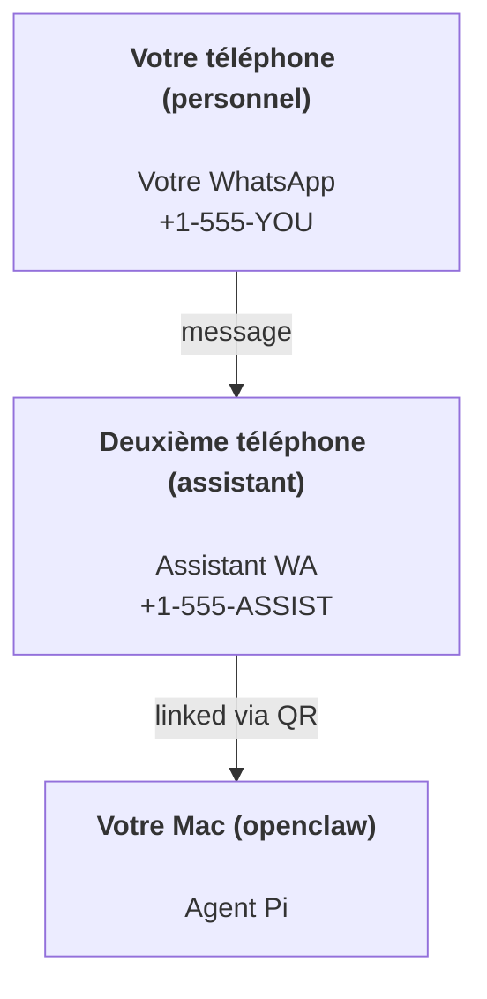

# Créer un assistant personnel avec OpenClaw

OpenClaw est une passerelle WhatsApp + Telegram + Discord + iMessage pour les agents **Pi**. Les plugins ajoutent Mattermost. Ce guide couvre la configuration « assistant personnel » : un numéro WhatsApp dédié qui se comporte comme votre agent toujours actif.

## ⚠️ La sécurité d'abord

Vous placez un agent en position de :

- exécuter des commandes sur votre machine (selon votre configuration d'outils Pi)
- lire/écrire des fichiers dans votre espace de travail
- envoyer des messages via WhatsApp/Telegram/Discord/Mattermost (plugin)

Commencez prudemment :

- Définissez toujours `channels.whatsapp.allowFrom` (ne jamais exécuter ouvert au monde sur votre Mac personnel).
- Utilisez un numéro WhatsApp dédié pour l'assistant.
- Les heartbeats sont maintenant définis par défaut toutes les 30 minutes. Désactivez jusqu'à ce que vous fassiez confiance à la configuration en définissant `agents.defaults.heartbeat.every: "0m"`.

## Prérequis

- OpenClaw installé et intégré — consultez [Getting Started](/start/getting-started) si vous ne l'avez pas encore fait
- Un deuxième numéro de téléphone (SIM/eSIM/prépayé) pour l'assistant

## La configuration à deux téléphones (recommandée)

Voici ce que vous voulez :



Si vous liez votre WhatsApp personnel à OpenClaw, chaque message qui vous arrive devient « entrée d'agent ». C'est rarement ce que vous voulez.

## Démarrage rapide en 5 minutes

1. Appairez WhatsApp Web (affiche un QR ; scannez avec le téléphone de l'assistant) :

```bash
openclaw channels login
```

2. Démarrez la Gateway (laissez-la en cours d'exécution) :

```bash
openclaw gateway --port 18789
```

3. Mettez une configuration minimale dans `~/.openclaw/openclaw.json` :

```json5
{
  channels: { whatsapp: { allowFrom: ["+15555550123"] } },
}
```

Maintenant, envoyez un message au numéro de l'assistant depuis votre téléphone autorisé.

Lorsque l'intégration est terminée, nous ouvrons automatiquement le tableau de bord et imprimons un lien propre (non tokenisé). S'il demande une authentification, collez le token de `gateway.auth.token` dans les paramètres de l'interface de contrôle. Pour rouvrir plus tard : `openclaw dashboard`.

## Donnez à l'agent un espace de travail (AGENTS)

OpenClaw lit les instructions d'exploitation et la « mémoire » à partir de son répertoire d'espace de travail.

Par défaut, OpenClaw utilise `~/.openclaw/workspace` comme espace de travail de l'agent et le créera (plus les fichiers de démarrage `AGENTS.md`, `SOUL.md`, `TOOLS.md`, `IDENTITY.md`, `USER.md`, `HEARTBEAT.md`) automatiquement lors de la configuration/première exécution de l'agent. `BOOTSTRAP.md` n'est créé que lorsque l'espace de travail est tout neuf (il ne devrait pas réapparaître après sa suppression). `MEMORY.md` est optionnel (non créé automatiquement) ; lorsqu'il est présent, il est chargé pour les sessions normales. Les sessions de sous-agent injectent uniquement `AGENTS.md` et `TOOLS.md`.

Conseil : traitez ce dossier comme la « mémoire » d'OpenClaw et transformez-le en dépôt git (idéalement privé) afin que vos fichiers `AGENTS.md` + mémoire soient sauvegardés. Si git est installé, les nouveaux espaces de travail sont initialisés automatiquement.

```bash
openclaw setup
```

Disposition complète de l'espace de travail + guide de sauvegarde : [Agent workspace](/concepts/agent-workspace)
Flux de travail de la mémoire : [Memory](/concepts/memory)

Optionnel : choisissez un espace de travail différent avec `agents.defaults.workspace` (supporte `~`).

```json5
{
  agent: {
    workspace: "~/.openclaw/workspace",
  },
}
```

Si vous livrez déjà vos propres fichiers d'espace de travail à partir d'un dépôt, vous pouvez désactiver entièrement la création de fichiers de bootstrap :

```json5
{
  agent: {
    skipBootstrap: true,
  },
}
```

## La configuration qui en fait « un assistant »

OpenClaw utilise par défaut une bonne configuration d'assistant, mais vous voudrez généralement ajuster :

- persona/instructions dans `SOUL.md`
- paramètres de réflexion (si souhaité)
- heartbeats (une fois que vous en êtes sûr)

Exemple :

```json5
{
  logging: { level: "info" },
  agent: {
    model: "anthropic/claude-opus-4-6",
    workspace: "~/.openclaw/workspace",
    thinkingDefault: "high",
    timeoutSeconds: 1800,
    // Commencez par 0 ; activez plus tard.
    heartbeat: { every: "0m" },
  },
  channels: {
    whatsapp: {
      allowFrom: ["+15555550123"],
      groups: {
        "*": { requireMention: true },
      },
    },
  },
  routing: {
    groupChat: {
      mentionPatterns: ["@openclaw", "openclaw"],
    },
  },
  session: {
    scope: "per-sender",
    resetTriggers: ["/new", "/reset"],
    reset: {
      mode: "daily",
      atHour: 4,
      idleMinutes: 10080,
    },
  },
}
```

## Sessions et mémoire

- Fichiers de session : `~/.openclaw/agents/<agentId>/sessions/{{SessionId}}.jsonl`
- Métadonnées de session (utilisation des tokens, dernier routage, etc) : `~/.openclaw/agents/<agentId>/sessions/sessions.json` (hérité : `~/.openclaw/sessions/sessions.json`)
- `/new` ou `/reset` démarre une nouvelle session pour ce chat (configurable via `resetTriggers`). S'il est envoyé seul, l'agent répond avec un court message de bienvenue pour confirmer la réinitialisation.
- `/compact [instructions]` compacte le contexte de la session et rapporte le budget de contexte restant.

## Heartbeats (mode proactif)

Par défaut, OpenClaw exécute un heartbeat toutes les 30 minutes avec l'invite :
`Read HEARTBEAT.md if it exists (workspace context). Follow it strictly. Do not infer or repeat old tasks from prior chats. If nothing needs attention, reply HEARTBEAT_OK.`
Définissez `agents.defaults.heartbeat.every: "0m"` pour désactiver.

- Si `HEARTBEAT.md` existe mais est effectivement vide (uniquement des lignes vides et des en-têtes markdown comme `# Heading`), OpenClaw ignore l'exécution du heartbeat pour économiser les appels API.
- Si le fichier est manquant, le heartbeat s'exécute quand même et le modèle décide quoi faire.
- Si l'agent répond avec `HEARTBEAT_OK` (optionnellement avec un court remplissage ; voir `agents.defaults.heartbeat.ackMaxChars`), OpenClaw supprime la livraison sortante pour ce heartbeat.
- Par défaut, la livraison du heartbeat aux cibles de style DM `user:<id>` est autorisée. Définissez `agents.defaults.heartbeat.directPolicy: "block"` pour supprimer la livraison aux cibles directes tout en gardant les exécutions de heartbeat actives.
- Les heartbeats exécutent des tours d'agent complets — les intervalles plus courts consomment plus de tokens.

```json5
{
  agent: {
    heartbeat: { every: "30m" },
  },
}
```

## Médias entrants et sortants

Les pièces jointes entrantes (images/audio/documents) peuvent être exposées à votre commande via des modèles :

- `{{MediaPath}}` (chemin du fichier temporaire local)
- `{{MediaUrl}}` (pseudo-URL)
- `{{Transcript}}` (si la transcription audio est activée)

Pièces jointes sortantes de l'agent : incluez `MEDIA:<path-or-url>` sur sa propre ligne (pas d'espaces). Exemple :

```
Here's the screenshot.
MEDIA:https://example.com/screenshot.png
```

OpenClaw extrait ces éléments et les envoie en tant que médias aux côtés du texte.

## Liste de contrôle des opérations

```bash
openclaw status          # statut local (identifiants, sessions, événements en attente)
openclaw status --all    # diagnostic complet (lecture seule, collable)
openclaw status --deep   # ajoute les sondes de santé de la gateway (Telegram + Discord)
openclaw health --json   # snapshot de santé de la gateway (WS)
```

Les journaux se trouvent sous `/tmp/openclaw/` (par défaut : `openclaw-YYYY-MM-DD.log`).

## Étapes suivantes

- WebChat : [WebChat](/web/webchat)
- Opérations Gateway : [Gateway runbook](/gateway)
- Cron + réveils : [Cron jobs](/automation/cron-jobs)
- Compagnon de barre de menu macOS : [OpenClaw macOS app](/platforms/macos)
- Application de nœud iOS : [iOS app](/platforms/ios)
- Application de nœud Android : [Android app](/platforms/android)
- Statut Windows : [Windows (WSL2)](/platforms/windows)
- Statut Linux : [Linux app](/platforms/linux)
- Sécurité : [Security](/gateway/security)
