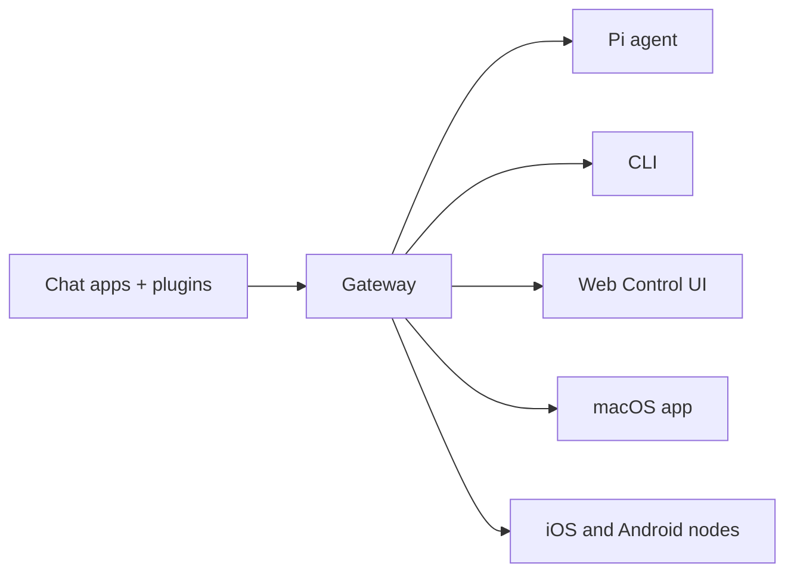

```markdown
---
read_when:
  - Présenter OpenClaw aux nouveaux utilisateurs
summary: OpenClaw est une passerelle Gateway AI multi-canal pour agents intelligents, fonctionnant sur n'importe quel système d'exploitation.
title: OpenClaw
x-i18n:
  generated_at: "2026-02-04T17:53:40Z"
  model: claude-opus-4-5
  provider: pi
  source_hash: fc8babf7885ef91d526795051376d928599c4cf8aff75400138a0d7d9fa3b75f
  source_path: index.md
  workflow: 15
---

# OpenClaw 🦞

<p align="center">
    
    
</p>

> _"Décortiquez ! Décortiquez !"_ — Probablement un homard spatial

<p align="center">
  <strong>Une passerelle Gateway AI pour agents intelligents sur n'importe quel système d'exploitation, prenant en charge WhatsApp, Telegram, Discord, iMessage, etc.</strong><br />
  Envoyez des messages et recevez des réponses d'agents n'importe où, n'importe quand. Ajoutez d'autres canaux comme Mattermost via des plugins.
</p>

<Columns>
  <Card title="Guide de démarrage" href="/start/getting-started" icon="rocket">
    Installez OpenClaw et lancez la passerelle Gateway en quelques minutes.
  </Card>
  <Card title="Assistant d'intégration" href="/start/wizard" icon="sparkles">
    Configuration guidée via `openclaw onboard` et processus d'appairage.
  </Card>
  <Card title="Ouvrir l'interface de contrôle" href="/web/control-ui" icon="layout-dashboard">
    Lancez le tableau de bord du navigateur pour gérer les chats, les configurations et les sessions.
  </Card>
</Columns>

OpenClaw connecte les applications de chat à des agents de programmation comme Pi via une seule passerelle Gateway. Il alimente l'assistant OpenClaw et prend en charge les déploiements locaux ou distants.

## Fonctionnement



La passerelle Gateway est la source unique de vérité pour les sessions, le routage et les connexions de canaux.

## Fonctionnalités principales

<Columns>
  <Card title="Passerelle Gateway multi-canal" icon="network">
    Connectez WhatsApp, Telegram, Discord et iMessage via une seule passerelle Gateway.
  </Card>
  <Card title="Canaux par plugin" icon="plug">
    Ajoutez d'autres canaux comme Mattermost via des packages d'extension.
  </Card>
  <Card title="Routage multi-agents" icon="route">
    Isolez les sessions par agent, espace de travail ou expéditeur.
  </Card>
  <Card title="Support des médias" icon="image">
    Envoyez et recevez des images, de l'audio et des documents.
  </Card>
  <Card title="Interface de contrôle Web" icon="monitor">
    Tableau de bord du navigateur pour les chats, les configurations, les sessions et la gestion des nœuds.
  </Card>
  <Card title="Nœuds mobiles" icon="smartphone">
    Appairez les nœuds iOS et Android avec support Canvas.
  </Card>
</Columns>

## Démarrage rapide

<Steps>
  <Step title="Installer OpenClaw">
    ```bash
    npm install -g openclaw@latest
    ```
  </Step>
  <Step title="Assistant d'intégration et installation du service">
    ```bash
    openclaw onboard --install-daemon
    ```
  </Step>
  <Step title="Appairer WhatsApp et lancer la passerelle Gateway">
    ```bash
    openclaw channels login
    openclaw gateway --port 18789
    ```
  </Step>
</Steps>

Besoin d'une installation complète et d'une configuration d'environnement de développement ? Consultez le [Démarrage rapide](/start/quickstart).

## Tableau de bord

Une fois la passerelle Gateway lancée, ouvrez l'interface de contrôle du navigateur.

- Adresse locale par défaut : http://127.0.0.1:18789/
- Accès distant : [Interface Web](/web) et [Tailscale](/gateway/tailscale)

<p align="center">
  
</p>

## Configuration (optionnel)

Le fichier de configuration se trouve à `~/.openclaw/openclaw.json`.

- Si vous **ne faites aucune modification**, OpenClaw utilisera le binaire Pi intégré en mode RPC et créera des sessions indépendantes par expéditeur.
- Si vous souhaitez restreindre l'accès, commencez par configurer `channels.whatsapp.allowFrom` et les règles de mention (pour les groupes).

Exemple :

```json5
{
  channels: {
    whatsapp: {
      allowFrom: ["+15555550123"],
      groups: { "*": { requireMention: true } },
    },
  },
  messages: { groupChat: { mentionPatterns: ["@openclaw"] } },
}
```

## À partir d'ici

<Columns>
  <Card title="Centre de documentation" href="/start/hubs" icon="book-open">
    Toute la documentation et les guides, organisés par cas d'usage.
  </Card>
  <Card title="Configuration" href="/gateway/configuration" icon="settings">
    Paramètres principaux de la passerelle Gateway, jetons et configuration des fournisseurs.
  </Card>
  <Card title="Accès distant" href="/gateway/remote" icon="globe">
    Modes d'accès SSH et tailnet.
  </Card>
  <Card title="Canaux" href="/channels/telegram" icon="message-square">
    Configuration spécifique pour WhatsApp, Telegram, Discord et autres canaux.
  </Card>
  <Card title="Nœuds" href="/nodes" icon="smartphone">
    Appairage des nœuds iOS et Android et fonctionnalités Canvas.
  </Card>
  <Card title="Aide" href="/help" icon="life-buoy">
    Correctifs courants et point d'entrée pour le dépannage.
  </Card>
</Columns>

## En savoir plus

<Columns>
  <Card title="Liste complète des fonctionnalités" href="/concepts/features" icon="list">
    Tous les canaux, le routage et les fonctionnalités de médias.
  </Card>
  <Card title="Routage multi-agents" href="/concepts/multi-agent" icon="route">
    Isolation des espaces de travail et gestion des sessions par agent.
  </Card>
  <Card title="Sécurité" href="/gateway/security" icon="shield">
    Jetons, listes blanches et contrôles de sécurité.
  </Card>
  <Card title="Dépannage" href="/gateway/troubleshooting" icon="wrench">
    Diagnostics de la passerelle Gateway et erreurs courantes.
  </Card>
  <Card title="À propos et remerciements" href="/reference/credits" icon="info">
    Origines du projet, contributeurs et licence.
  </Card>
</Columns>
```
